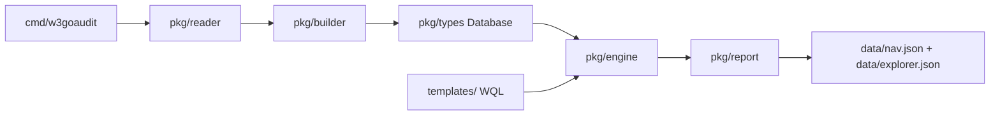

# w3goaudit Project Index

## Purpose

`w3goaudit` is a Go CLI and SDK for static analysis of Solidity projects. It
builds a contract database, executes WQL YAML templates, and writes an audit
result folder with human-readable reports plus machine-readable artifacts.

## Data Flow



Canonical pipeline: `Reader -> Builder -> Database -> Engine -> Report`. Source
locations (line/col/byte, from solast-go) are threaded from the builder onto
AST nodes and declarations all the way through to `Report`, which also derives
the extension-facing `nav.json`/`explorer.json` navigation artifacts from the
finished `Database`/`Findings`, independent of the WQL template surface.

## Package Map

| Path | Responsibility | Local Index |
|---|---|---|
| `cmd/w3goaudit/` | Cobra CLI: root scan, build, extract, update, completion, result-folder orchestration | `cmd/w3goaudit/INDEX.md` |
| `pkg/reader/` | Discover/load `.sol` files, resolve imports/remappings, detect project/git info | `pkg/reader/INDEX.md` |
| `pkg/logging/` | Immutable scan-local verbose logger with serialized writes | `pkg/logging/INDEX.md` |
| `pkg/builder/` | Parse source into database, build simplified ASTs, C3 inheritance, call graph, selectors, effects | `pkg/builder/INDEX.md` |
| `pkg/types/` | Core serialized data structures: database, contracts, functions, AST, call graph, semantic facts | `pkg/types/INDEX.md` |
| `pkg/engine/` | WQL template loading, validation, execution, taint/reachability, finding construction | `pkg/engine/INDEX.md` |
| `pkg/report/` | Markdown/HTML/SARIF/JSON output, result folder, state matrix, workflow files, source excerpts | `pkg/report/INDEX.md` |
| `pkg/home/` | `~/.w3goaudit` config/template-home management and release download | `pkg/home/INDEX.md` |
| `templates/` | Official embedded WQL detector pack plus benchmark and feature-test templates | `templates/INDEX.md` |
| `benchmarks/` | Docker-only competitive analyzer benchmark, corpora, fixtures, adapters, and quality threshold gate | `benchmarks/README.md` |
| `test-data/` | Canonical Solidity fixtures: security matrices plus core builder/engine/extract/identity cases | `test-data/README.md` |

## Benchmark Harness Map

The competitive benchmark keeps scanner and corpus-case execution sequential,
with the Python harness divided into focused modules:

| Path | Responsibility |
|---|---|
| `benchmarks/run_benchmark.py` | CLI and sequential orchestration. |
| `benchmarks/benchmark_core.py` | Paths, source indexes, process I/O, aliases, and manifests. |
| `benchmarks/benchmark_adapters.py` | Scanner commands and native-output normalization. |
| `benchmarks/benchmark_scoring.py` | Exact/call-chain-relaxed matching and metrics. |
| `benchmarks/benchmark_reporting.py` | `benchmark.md` rendering. |
| `benchmarks/call_chain.py` | Internal-call reachability helper. |
| `benchmarks/assert_thresholds.py` | Release-quality threshold gate. |

The only supported multi-tool host workflow remains:

```bash
docker compose -f benchmarks/compose.yaml run --rm benchmark
```

## Core Invariants

- Use the Go version declared by `go.mod` (currently Go 1.26.5). This is a
  security floor: the standard-library fixes required by govulncheck need
  Go >=1.25.12. Local and external build automation should read `go.mod`
  directly rather than duplicating the version.
- The only supported multi-tool benchmark workflow runs through
  `benchmarks/compose.yaml` on `linux/amd64`, fails before output when any
  requested scanner is unavailable, and writes only beneath the mounted,
  Git-ignored `benchmarks/results/` directory. The Dockerfile verifies the
  reviewed generated-lock hash for its pinned 4naly3er commit, so the canonical
  Compose command requires no build arguments. Slither and 4naly3er analyze
  directory cases as sorted, independent Solidity fragments and aggregate the
  successful reports. Missing Slither JSON is non-analyzable only when captured
  output proves a solc/compiler failure; missing 4naly3er reports additionally
  require both `Cannot compile AST for` and a structured Solidity compiler
  error. Crashes, timeouts, unexplained missing output, nonzero 4naly3er exits
  with a report, and other runtime failures count as benchmark errors. A case
  where no fragment produces output is also an error.
- The root command is the scan: `w3goaudit <path>`. There is no `scan` subcommand.
- Scan-local pipelines can inject one `pkg/logging.Logger` through reader,
  builder, engine, database loading, template loading, and report generation.
  Package-global verbose flags/writers remain deprecated compatibility wrappers
  for legacy constructors only; scan-local objects never consult them.
- A normal scan writes one result folder containing `README.md`, `summary.md`, `overview.md`, `findings.md`, `results.sarif`, `run.log`, `data/` (with `manifest.json` index, plus `nav.json` and `explorer.json`), and a `contracts/` tree (per-main-contract folders mirroring source paths, each with its own `README.md`).
- AST nodes and declarations (`Function`/`Modifier`/`Contract`/`StateVariable`/`Event`/`Struct`/`Enum`/`Parameter`) carry `StartCol`/`EndCol`/`StartByte`/`EndByte` alongside `StartLine`/`EndLine` (one-based Unicode-code-point columns and zero-based UTF-8 byte offsets; both end fields are half-open; zero/omitted for synthetic nodes). `FunctionCall`/`CallEdge` carry point `Col`/`Byte` fields too. The builder derives columns from a once-per-source sparse line/non-ASCII index instead of the parser's byte-oriented column field: O(log non-ASCII runes on the line) per endpoint and O(lines + non-ASCII runes) index memory. Invalid conversions retain lines/bytes, omit columns, and record `location.invalid`. Output schema remains `2.0.0`; this requires solast-go v0.1.7+.
- Public template YAML is **WQL**: `meta` plus one `query:` holding
  `select`/`from`/`where` or a one-level `and:`/`or:` query composition.
  Unknown keys are rejected at every level. Documents are lowered into the
  `Template`/`QueryBlock`/`Rule` evaluator IR (`TemplateDoc.lower()` in
  `pkg/engine/wql_v2.go`) — `and:` lowers to one block whose match is an
  `all:` of labeled branch rules at the join scope; `or:` lowers to one
  QueryBlock per branch (`Template.Queries`), executed as a deduplicated
  union — so evaluator behavior (taint/reachability/matching) is independent
  of the authoring surface.
- Template loading is fail-closed by default. Lenient loading is explicit via `--ignore-invalid-templates` or `TemplateLoadOptions{IgnoreInvalid:true}`.
- In the evaluator `Rule` IR (what WQL lowers to), `filter:` is for context-level preconditions and `match:` is for AST/source matching; `validateRulePlacement` enforces this. Templates don't write `filter:`/`match:` directly — `from` supplies scope, `where` supplies matchers.
- Contract scopes (`main_contract`, `all_contract`, `contract`, `library`, `abstract`) evaluate `match:` against a synthetic `decl.contract` AST containing resolved functions from the linearized inheritance chain.
- Findings may include `reachability`, `entryPoint`, `primaryAst`, and `related` matched sites. These fields are additive JSON/SARIF/report context.
- `Finding.Location` and `primaryAst` carry the matched node's precise span (`col`/`endLine`/`endCol`/`startByte`/`endByte`) when the location anchors on that node; SARIF declares `columnKind: unicodeCodePoints` and emits `startColumn`/`endColumn`/`endLine`, but never mislabels UTF-8 bytes as `charOffset`/`charLength`. Reachability steps carry a per-hop `file` so cross-contract traces render at the correct file.
- Finding output is deterministic: `Engine.ExecuteAll` applies a total-order sort (`SortFindings`) before returning, so `findings.json`/`results.sarif`/`findings.md` are byte-stable across runs despite map-order iteration internally.
- Generated timestamps are the one intentional source of report-byte variance.
  `GeneratorOptions.Now` and `BundleOptions.Now` let SDK callers inject a fixed
  clock; a complete fixed-clock bundle is byte-stable.
- Identity-sensitive code uses exact contracts and exact C3 identities, never a
  short-name or same-directory guess. `LinearizedBaseIDs` is canonical;
  `LinearizedBases` remains display/compatibility data. `ResolveContractNameExact`
  uses the current file plus canonical `ResolvedImports` and returns ambiguity
  instead of selecting a plausible candidate. `GetContractByName` and
  `ResolveContractName` remain compatibility helpers only.
- Contract and function IDs use absolute paths: `absPath#ContractName` and `absPath#ContractName.selector(argTypes)`.
- Build-cache JSON must round-trip with `scan --db`; serialized AST parent links are restored by `Database.RestoreASTParents()`.
- Recoverable analysis loss is durable: source and `--db` scans share the same
  sorted `Database.Diagnostics`, warning summary, and `data/diagnostics.json`.
  Default scans remain tolerant; `--strict-imports` fails before template
  execution/report writing when any persisted unresolved-import diagnostic exists.
- `data/manifest.json` distinguishes `projectRoot` from `scanTarget` (`target`
  is the compatibility alias), exposes `analysisComplete`/`diagnosticCounts`,
  counts contracts/interfaces/libraries/declarations separately, and indexes
  every emitted data/HTML artifact.
- Import discovery decodes valid Solidity string escapes before resolution and
  rejects malformed escaped paths. Foundry remappings honor the active profile
  and context relative to the importing file's owning sub-project; applicable
  mappings rank by context specificity, then import-prefix specificity.

## Documentation Map

| Doc | Use |
|---|---|
| `README.md` | User-facing quick start, feature overview, result-folder shape |
| `docs/project-overview.md` | Architecture and package-level system design |
| `docs/workflows.md` | Scan/build/report execution workflows |
| `docs/wql-syntax.md` | WQL template language reference |
| `docs/extension-output.md` | `data/nav.json` + `data/explorer.json` schema for the future VSCode extension |
| `docs/usage.md` | Full CLI usage, flags, result artifacts |
| `docs/sdk.md` | Go SDK package/type/function reference |

## Current WQL/Report Notes

- Contract-scope AST matching is designed for same-contract combination rules,
  such as "payable `msg.value` accounting plus inherited `Multicall.multicall`".
- For multi-condition contract findings, `Finding.Related` carries all matched
  contributing sites. Markdown renders `All matched sites` and full function
  excerpts for each related site. Each `match.all` branch may carry an optional
  `label:` that names its sites in that list (falling back to `condition N`);
  labels live in the template, not the engine.
- `Finding.Location` is still the primary anchor; `Finding.Related` is for the
  complete contributing context.
- Public templates use WQL (`query:` with `select`/`from`/`where`, or a
  query-level `and:`/`or:` composition) with intuitive-polarity presets
  (`access_controlled`, `caller_checked`, `reentrancy_guarded`); explicit
  `tainted: parameter` expresses parameter-controlled data. All 106 official
  + benchmark + feature-test templates use it. `select` is an optional
  scalar; a fully specified top-level `sequence:` supplies its own anchor.
  `arg.any:` matches any positional call argument; `and:` in `where` is an
  alias of `all:`.
- `data/nav.json` is a flat symbol-level navigation index (definitions, caller
  edges, interface→implementation map); `data/explorer.json` is a
  per-main-contract model (ordered constants/storage, entry-callable functions,
  view getters). Both are built in `pkg/report` (`nav.go`/`explorer.go`),
  manifest-indexed, and share the same `schemaVersion` as `overview.json`/`findings.json`.

## Change Checklist

Before changing code:

- Read this file and the `INDEX.md` of every touched package.
- Read relevant docs in `docs/` for WQL, workflow, SDK, or CLI changes.

After changing code:

- Update the touched package `INDEX.md` files.
- Update user docs (`README.md`, `docs/*.md`) for behavior/API/output changes.
- Add or update tests for the behavior, including safe/vulnerable cases for new security templates.
- Run focused tests at minimum; for broad changes prefer `go test ./...`.

## Verification Commands

```bash
go test ./pkg/engine ./pkg/types ./pkg/report -count=1
go test ./pkg/... -count=1
go build -o w3goaudit ./cmd/w3goaudit
./w3goaudit test-data/security/ --template templates/official/ --verbose

# Docker Compose is the only supported competitive-benchmark host workflow.
# The Dockerfile derives and verifies the Go version directly from go.mod.
docker compose -f benchmarks/compose.yaml run --rm benchmark
```
