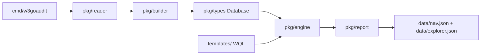

# w3goaudit Project Index

## Purpose

`w3goaudit` is a Go CLI and SDK for static analysis of Solidity projects. It
builds a contract database, executes WQL YAML templates, and writes an audit
result folder with human-readable reports plus machine-readable artifacts.

## Data Flow



Canonical pipeline: `Reader -> Builder -> Database -> Engine -> Report`. Source
locations (line/col/byte, from solast-go) are threaded from the builder onto
AST nodes and declarations all the way through to `Report`, which also derives
the extension-facing `nav.json`/`explorer.json` navigation artifacts from the
finished `Database`/`Findings`, independent of the WQL template surface.

## Package Map

| Path | Responsibility | Local Index |
|---|---|---|
| `cmd/w3goaudit/` | Cobra CLI: root scan, build, extract, update, completion, result-folder orchestration | `cmd/w3goaudit/INDEX.md` |
| `pkg/reader/` | Discover/load `.sol` files, resolve imports/remappings, detect project/git info | `pkg/reader/INDEX.md` |
| `pkg/logging/` | Immutable scan-local verbose logger with serialized writes | `pkg/logging/INDEX.md` |
| `pkg/builder/` | Parse source into database, build simplified ASTs, C3 inheritance, call graph, selectors, effects | `pkg/builder/INDEX.md` |
| `pkg/types/` | Core serialized data structures: database, contracts, functions, AST, call graph, semantic facts | `pkg/types/INDEX.md` |
| `pkg/engine/` | WQL template loading, validation, execution, taint/reachability, finding construction | `pkg/engine/INDEX.md` |
| `pkg/report/` | Markdown/HTML/SARIF/JSON output, result folder, state matrix, workflow files, source excerpts | `pkg/report/INDEX.md` |
| `pkg/home/` | `~/.w3goaudit` config/template-home management and release download | `pkg/home/INDEX.md` |
| `templates/` | Official embedded WQL detector pack plus benchmark and feature-test templates | `templates/INDEX.md` |
| `scripts/benchmark/` | Competitive analyzer benchmark harness, corpora, fixtures, adapters, and quality threshold gate (local CLI for w3goaudit; Docker Compose only for multi-tool comparison) | `scripts/benchmark/README.md` |
| `benchmarks/` | Stored benchmark results: tracked dated reports (`yyyy-mm-dd-<commit-slug>.md`) plus the Git-ignored `results/` run-output scratch directory | `benchmarks/README.md` |
| `test-data/` | Canonical Solidity fixtures: security matrices plus core builder/engine/extract/identity cases | `test-data/README.md` |

## Benchmark Harness Map

The competitive benchmark keeps scanner and corpus-case execution sequential,
with the Python harness divided into focused modules:

| Path | Responsibility |
|---|---|
| `scripts/benchmark/run_benchmark.py` | CLI and sequential orchestration. |
| `scripts/benchmark/benchmark_core.py` | Paths, source indexes, process I/O, aliases, and manifests. |
| `scripts/benchmark/benchmark_adapters.py` | Scanner commands and native-output normalization. |
| `scripts/benchmark/benchmark_scoring.py` | Exact/call-chain-relaxed matching and metrics. |
| `scripts/benchmark/benchmark_reporting.py` | `benchmark.md` rendering. |
| `scripts/benchmark/call_chain.py` | Internal-call reachability helper. |
| `scripts/benchmark/assert_thresholds.py` | Release-quality threshold gate. |

The primary workflow is the local CLI (no Docker):

```bash
go build -o /tmp/w3goaudit ./cmd/w3goaudit
python3 scripts/benchmark/run_benchmark.py --suite competitive --tools w3goaudit \
  --w3goaudit-bin /tmp/w3goaudit --out benchmarks/results/latest
python3 scripts/benchmark/assert_thresholds.py benchmarks/results/latest/benchmark.json
```

Docker Compose is used only when comparing against the other scanners
(Slither/Semgrep/4naly3er):

```bash
docker compose -f scripts/benchmark/compose.yaml run --rm benchmark
```

Durable results are stored as tracked dated reports in `benchmarks/`
(`yyyy-mm-dd-<commit-slug>.md`); `benchmarks/results/` remains the Git-ignored
run-output scratch directory.

## Core Invariants

- Use the Go version declared by `go.mod` (currently Go 1.26.5). This is a
  security floor: the standard-library fixes required by govulncheck need
  Go >=1.25.12. Local and external build automation should read `go.mod`
  directly rather than duplicating the version.
- The w3goaudit-only benchmark quality gate runs through the local CLI
  (`scripts/benchmark/run_benchmark.py` + `assert_thresholds.py`). The only
  supported multi-tool benchmark workflow runs through
  `scripts/benchmark/compose.yaml` on `linux/amd64`, fails before output when any
  requested scanner is unavailable, and writes only beneath the mounted,
  Git-ignored `benchmarks/results/` directory. The Dockerfile verifies the
  reviewed generated-lock hash for its pinned 4naly3er commit, so the canonical
  Compose command requires no build arguments. Slither and 4naly3er analyze
  directory cases as sorted, independent Solidity fragments and aggregate the
  successful reports. Missing Slither JSON is non-analyzable only when captured
  output proves a solc/compiler failure; missing 4naly3er reports additionally
  require both `Cannot compile AST for` and a structured Solidity compiler
  error. Crashes, timeouts, unexplained missing output, nonzero 4naly3er exits
  with a report, and other runtime failures count as benchmark errors. A case
  where no fragment produces output is also an error.
- Benchmark category keys describe vulnerability semantics rather than native
  detector lineage. Synonymous rule families share one canonical category:
  `SLITHER-SUICIDAL` and `DECURITY-ACCESSIBLE-SELFDESTRUCT` map to
  `selfdestruct`, while `SLITHER-CONTROLLED-DELEGATECALL` and
  `DECURITY-DELEGATECALL-TO-ARBITRARY-ADDRESS` map to
  `controlled-delegatecall`.
- The root command is the scan: `w3goaudit <path>`. There is no `scan` subcommand.
- `Function.Selector` is canonical text such as
  `transfer(address,uint256)`; `Function.Signature` is the four-byte Keccak
  value. Source columns are one-based, half-open Unicode code points and byte
  ranges are zero-based, half-open UTF-8 offsets. They are not LSP positions.
- Solidity `for` AST children follow runtime order: initialization, condition,
  body, then post. Storage-array `push`/`pop` are non-call
  `stmt.state_mutation` nodes, and `state_write` also covers state assignment,
  state-targeted `delete`/`++`/`--`, and `asm.sstore`.
- Synthetic contract ASTs retain exact declaration kinds and spans. Active
  inherited functions are deduplicated by canonical selector so the
  most-derived override wins while overloads remain distinct. `guarded_by`
  can match an inline guard or an exact applied modifier body; a modifier name
  alone does not imply access control.
- A where-only query with actionable AST evidence defaults to
  `entry_function`; context-only where clauses are rejected because they
  cannot anchor a finding.
- Scan-local pipelines can inject one `pkg/logging.Logger` through reader,
  builder, engine, database loading, template loading, and report generation.
  Package-global verbose flags/writers remain deprecated compatibility wrappers
  for legacy constructors only; scan-local objects never consult them.
- A normal scan writes one result folder containing `README.md`, `summary.md`, `overview.md`, `findings.md`, `results.sarif`, `run.log`, `data/` (with `manifest.json` index, plus `nav.json` and `explorer.json`), and a `contracts/` tree (per-main-contract folders mirroring source paths, each with its own `README.md`).
- AST nodes and declarations (`Function`/`Modifier`/`Contract`/`StateVariable`/`Event`/`Struct`/`Enum`/`Parameter`) carry `StartCol`/`EndCol`/`StartByte`/`EndByte` alongside `StartLine`/`EndLine` (one-based Unicode-code-point columns and zero-based UTF-8 byte offsets; both end fields are half-open; zero/omitted for synthetic nodes). `FunctionCall`/`CallEdge` carry point `Col`/`Byte` fields too. The builder derives columns from a once-per-source sparse line/non-ASCII index instead of the parser's byte-oriented column field: O(log non-ASCII runes on the line) per endpoint and O(lines + non-ASCII runes) index memory. Invalid conversions retain lines/bytes, omit columns, and record `location.invalid`. Output schema remains `2.0.0`; this requires solast-go v0.1.7+.
- A WQL document is meta plus one query: block. The block holds
  `select`/`from`/`where` or a one-level `and:`/`or:` query composition.
  Unknown keys and YAML merge keys (`<<`) are rejected at every level.
  Explicitly authored `select:`, `from:`, and branch `label:` values must be
  non-null, non-empty scalars; explicitly authored `where:` values must be
  non-null, non-empty matcher lists. Empty nested matcher maps/lists, empty
  required matcher strings, `unchecked_var: false`, and non-decimal or signed
  `arg.N` keys are rejected before execution.
  Composition keys are validated by presence, so null or empty lists cannot
  fall through as simple queries and explicitly present `and:`/`or:` keys
  remain mutually exclusive. Documents are lowered into the
  `Template`/`QueryBlock`/`Rule` evaluator IR (`TemplateDoc.lower()` in
  `pkg/engine/wql.go`) — `and:` lowers to one block whose match uses labeled
  `Rule.All` branches at the join scope and rejects any branch without a
  positive reportable anchor and traceable AST evidence; regex may refine an
  AST-anchored branch but cannot be its only evidence or own its provenance.
  Positive-polarity nested select-less sequences are checked recursively and
  must anchor on step one; sequences used only inside `not:` remain refinement
  evidence. `or:` lowers to one
  QueryBlock per branch (`Template.Queries`), executed as a union that
  deduplicates only the same precise site across branches while retaining
  intra-branch duplicates and imprecise findings. The canonical key is the
  exact file and precise span plus an optional concrete kind: unknown-kind
  provenance is provisional and is replaced when the first concrete kind
  arrives at that span, so unknown-first and unknown-last orders agree while
  two different known kinds remain distinct. Identity is independent of
  whether provenance arrived through `PrimaryAST` or `Location` – so evaluator behavior
  (taint/reachability/matching) is independent
  of the authoring surface.
- Template loading is fail-closed by default. Lenient loading is explicit via `--ignore-invalid-templates` or `TemplateLoadOptions{IgnoreInvalid:true}`.
- In the evaluator `Rule` IR (what WQL lowers to), `filter:` is for context-level preconditions and `match:` is for AST/source matching; `validateRulePlacement` enforces this. Templates don't write `filter:`/`match:` directly — `from` supplies scope, `where` supplies matchers.
- Deprecated programmatic `Rule` aliases are normalized on a recursive deep
  copy at every exported evaluator entry point and template execution path.
  The copy rejects active pointer cycles and nesting beyond depth 64 before
  later recursive walkers run. Nested `Attr` maps and slices, including values
  supplied through exported `Rule.IsStateVar`, share the same
  depth budget and active-container cycle checks while shared DAGs remain
  valid. Conflicts and malformed graphs fail closed
  without mutating caller-owned maps, slices, or nested rules; WQL remains
  canonical.
- Contract scopes (`main_contract`, `all_contract`, `contract`, `library`, `abstract`) evaluate `match:` against a synthetic `decl.contract` AST containing resolved functions from the linearized inheritance chain.
- Findings may include `reachability`, `entryPoint`, `primaryAst`, and `related` matched sites. These fields are additive JSON/SARIF/report context.
- `Finding.Location` and `primaryAst` carry the matched node's precise span (`col`/`endLine`/`endCol`/`startByte`/`endByte`) when the location anchors on that node; SARIF declares `columnKind: unicodeCodePoints` and emits `startColumn`/`endColumn`/`endLine`, but never mislabels UTF-8 bytes as `charOffset`/`charLength`. Reachability steps carry a per-hop `file` so cross-contract traces render at the correct file.
- Matched-node location mode always takes line, columns, and bytes from the
  committed primary node. Host file/contract/function prefer the final
  interprocedural trace hop, then the enclosing declaration, then verifier
  fallbacks. Sequence backtracking restores abandoned primary anchors, and
  member-side name matches plus contract-root joins retain their exact related
  evidence.
- Inherited entry scans retain the derived contract for runtime MRO and callee
  resolution, but each reachability hop is attributed to the exact owning
  function source. Contract-scope findings with a real primary span anchor on
  the actual inherited or local matched node and exact owner context;
  location-less primary matches remain at the verified contract/file level
  instead of borrowing a nearby function or line.
- Interprocedural traversal carries the current caller function explicitly for
  recorded selector lookup and `super` binding. Solidity `call.*` nodes are
  followed only for recorded internal, inherited, self, super, or library
  calls; member receivers and call options are excluded from parameter binding.
  Sequence matching uses an execution-event partial order: receiver, option,
  argument, assignment-RHS, return, emit, check, and similar operand/value
  subtrees precede their enclosing effect; calls precede inlined callees; and
  distinct pre-effect sibling expressions may occur in either order. Every
  event owns its exact inline occurrence path plus accumulated caller/callee
  conditional-arm tokens, so mutually exclusive cross-function arms cannot
  form a sequence and reused callee AST pointers retain the selected occurrence
  reachability. Raw AST ancestry and execution-path checks apply only within
  one function expansion; distinct expansions use the event partial order and
  occurrence-specific arm tokens. Callgraph construction records nested
  receiver/option calls exactly once so those helpers can be inlined.
- Finding output is deterministic: `Engine.ExecuteAll` applies a total-order sort (`SortFindings`) before returning, so `findings.json`/`results.sarif`/`findings.md` are byte-stable across runs despite map-order iteration internally.
- Generated timestamps are the one intentional source of report-byte variance.
  `GeneratorOptions.Now` and `BundleOptions.Now` let SDK callers inject a fixed
  clock; a complete fixed-clock bundle is byte-stable.
- Identity-sensitive code uses exact contracts and exact C3 identities, never a
  short-name or same-directory guess. `LinearizedBaseIDs` is canonical;
  `LinearizedBases` remains display/compatibility data. `ResolveContractNameExact`
  uses the current file plus serialized per-occurrence `ImportBindings` and
  canonical `ResolvedImports`; named aliases and namespace-qualified names map
  only to exact imported declarations. Missing or ambiguous bindings fail
  closed instead of selecting a plausible candidate. `GetContractByName` and
  `ResolveContractName` remain compatibility helpers only.
- Contract and function IDs use absolute paths: `absPath#ContractName` and `absPath#ContractName.selector(argTypes)`.
- Build-cache JSON must round-trip with `scan --db`; serialized AST parent links are restored by `Database.RestoreASTParents()`.
- Recoverable analysis loss is durable: source and `--db` scans share the same
  sorted `Database.Diagnostics`, warning summary, and `data/diagnostics.json`.
  Default scans remain tolerant; `--strict-imports` fails before template
  execution/report writing when any persisted unresolved-import diagnostic
  exists. Legacy name-only MRO caches record one incomplete
  `identity.unresolved` diagnostic for every base entry that exact source/import
  resolution cannot materialize.
- `data/manifest.json` distinguishes `projectRoot` from `scanTarget` (`target`
  is the compatibility alias), exposes `analysisComplete`/`diagnosticCounts`,
  counts contracts/interfaces/libraries/declarations separately, and indexes
  every emitted data/HTML artifact.
- Import discovery decodes valid Solidity string escapes before resolution and
  rejects malformed escaped paths. Foundry remappings honor the active profile
  and context relative to the importing file's owning sub-project; applicable
  mappings rank by context specificity, then import-prefix specificity.
- Parsed calls with known arguments never resolve a same-name declaration of
  the wrong arity. They retain no exact target and emit one durable
  `identity.unresolved` diagnostic with the observed arity. Serialized
  `FunctionCall.argCount` is presence-aware: an absent legacy field loads as
  `-1`, while a genuine zero is emitted and round-trips as zero.
- Benchmark fallback source attribution masks Solidity comments and quoted
  strings with a length/newline-preserving lexer before declaration matching
  and brace counting.

## Documentation Map

Compatibility/exactness repair notes:

- Deprecated evaluator-IR JSON fields `source_regex`, `visibility_filter`, and
  `mutability_filter` normalize into canonical fields before validation and
  execution, while canonical WQL YAML rejects those keys.
- Source-scoped exact contract resolution requires same-file or import
  provenance even for a sole global candidate. Engine callee resolution uses
  precise call sites, exact IDs, full selectors, and unique legacy fallback.
- Report call graphs, state matrices, and workflow closure share one exact call
  resolver: recorded contract IDs/full selectors win, and legacy arity/name
  metadata succeeds only when one distinct runtime-MRO selector remains.
- Navigation publishes caller edges only for resolved target IDs that map to an
  existing exact function. `extract diff` compares slash-normalized
  source-relative `path.sol#Contract` keys and full selectors across checkout
  roots.
- Display `LinearizedBases` and compact exact `LinearizedBaseIDs` are not
  index-aligned by contract. Expression-statement AST ranges remain owned by
  the semantic expression and exclude the terminating semicolon.

| Doc | Use |
|---|---|
| `README.md` | User-facing quick start, feature overview, result-folder shape |
| `docs/project-overview.md` | Architecture and package-level system design |
| `docs/workflows.md` | Scan/build/report execution workflows |
| `docs/wql-syntax.md` | WQL template language reference |
| `docs/extension-output.md` | `data/nav.json` + `data/explorer.json` schema for the future VSCode extension |
| `docs/usage.md` | Full CLI usage, flags, result artifacts |
| `docs/sdk.md` | Go SDK package/type/function reference |

## Current WQL/Report Notes

- Contract-scope AST matching is designed for same-contract combination rules,
  such as "payable `msg.value` accounting plus inherited `Multicall.multicall`".
- For multi-condition function and contract findings, `Finding.Related` carries
  each labeled contributing node with exact file, line/Unicode-column, and
  UTF-8 byte provenance when available; a positive synthetic contract-root
  branch contributes a contract/file record with no borrowed function or
  precise byte/column span. Markdown renders `All matched sites` and full
  function excerpts for each related site. Each public `and:` branch may carry an
  optional `label:` that names its sites in that list (falling back to
  `condition N`); WQL lowering stores these branches in internal `Rule.All`.
- `Finding.Location` is still the primary anchor; `Finding.Related` is for the
  complete contributing context.
- Public templates use WQL (`query:` with `select`/`from`/`where`, or a
  query-level `and:`/`or:` composition) with intuitive-polarity presets
  (`access_controlled`, `caller_checked`, `reentrancy_guarded`) that are direct
  evaluator property checks; normal `not:` expresses a property's absence.
  `tainted: user_controlled` matches parameter or caller-identity taint, while
  the narrower explicit sources remain available. Caller identity is limited
  to `msg.sender`, `tx.origin`, and an exact zero-argument internal
  `_msgSender()` helper confirmed by call metadata and exact MRO resolution
  when those facts are available. A non-nil but empty or unresolvable database
  is unavailable resolution context, so an exact synthetic zero-argument
  `call.internal` retains the compatibility fallback; once an exact owner/MRO
  is available, a missing helper or nonzero overload disproves the identity.
  Same-named identifiers, state/local/parameter
  names, external/self calls, unresolved calls, and nonzero overloads retain
  their ordinary provenance. All 106 official
  + benchmark + feature-test templates use it. `select` is an optional
  scalar; a fully specified sequence supplies its own anchor, and every
  positive-polarity sequence nested under a select-less matcher must guarantee
  positive actionable evidence in its first step.
  `arg.any:` matches any positional call argument; repeated sibling
  `arg.any:` predicates are independent existential checks and may match
  different arguments. Repeated sibling `not:` predicates are also preserved
  as independent implicit-conjunction checks, so `not: A` plus `not: B` means
  `(not A) and (not B)`. `and:` is the only explicit public conjunction.
- `unchecked_var` clears unsigned subtraction only when exact stable operands
  are locally proven as `left >= right` by an enforced require/assert, a
  dominating safe arm whose subtraction is the first executable operation
  through block/unchecked wrappers, or fallthrough after an unsafe arm exits
  with no surviving effect. The first intervening statement or call ends the
  proof. Before any proof is accepted, the full expression path must contain
  only allowlisted pure wrappers and structurally effect-free siblings. The
  complete guard condition and every additional `require`/`assert` argument
  must also be structurally effect-free; call
  ancestors, assignment-expression siblings, creation, increment/decrement,
  delete, and unknown evaluation order remain findings. Reversed or unrelated
  inequalities, signed arithmetic, and unstable operands also fail closed.
- `data/nav.json` is a flat symbol-level navigation index (definitions, caller
  edges, interface→implementation map); `data/explorer.json` is a
  per-main-contract model (ordered constants/storage, entry-callable functions,
  view getters). Both are built in `pkg/report` (`nav.go`/`explorer.go`),
  manifest-indexed, and share the same `schemaVersion` as `overview.json`/`findings.json`.

## Change Checklist

Before changing code:

- Read this file and the `INDEX.md` of every touched package.
- Read relevant docs in `docs/` for WQL, workflow, SDK, or CLI changes.

After changing code:

- Update the touched package `INDEX.md` files.
- Update user docs (`README.md`, `docs/*.md`) for behavior/API/output changes.
- Add or update tests for the behavior, including safe/vulnerable cases for new security templates.
- Run focused tests at minimum; for broad changes prefer `go test ./...`.

## Verification Commands

```bash
go test ./pkg/engine ./pkg/types ./pkg/report -count=1
go test ./pkg/... -count=1
go build -o w3goaudit ./cmd/w3goaudit
./w3goaudit test-data/security/ --template templates/official/ --verbose

# Competitive quality gate via the local CLI (no Docker).
go build -o /tmp/w3goaudit ./cmd/w3goaudit
python3 scripts/benchmark/run_benchmark.py --suite competitive --tools w3goaudit \
  --w3goaudit-bin /tmp/w3goaudit --out benchmarks/results/latest
python3 scripts/benchmark/assert_thresholds.py benchmarks/results/latest/benchmark.json

# Docker Compose only for the multi-tool comparison (Slither/Semgrep/4naly3er).
# The Dockerfile derives and verifies the Go version directly from go.mod.
docker compose -f scripts/benchmark/compose.yaml run --rm benchmark
```
