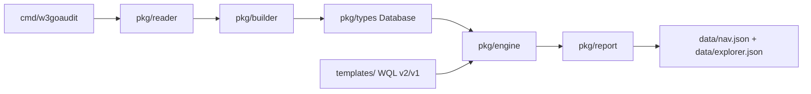

# w3goaudit Project Index

## Purpose

`w3goaudit` is a Go CLI and SDK for static analysis of Solidity projects. It
builds a contract database, executes WQL YAML templates, and writes an audit
result folder with human-readable reports plus machine-readable artifacts.

## Data Flow



Canonical pipeline: `Reader -> Builder -> Database -> Engine -> Report`. Source
locations (line/col/byte, from solast-go) are threaded from the builder onto
AST nodes and declarations all the way through to `Report`, which also derives
the extension-facing `nav.json`/`explorer.json` navigation artifacts from the
finished `Database`/`Findings`, independent of the WQL template surface.

## Package Map

| Path | Responsibility | Local Index |
|---|---|---|
| `cmd/w3goaudit/` | Cobra CLI: root scan, build, extract, update, completion, result-folder orchestration | No local index yet; see `docs/usage.md` |
| `pkg/reader/` | Discover/load `.sol` files, resolve imports/remappings, detect project/git info | `pkg/reader/INDEX.md` |
| `pkg/builder/` | Parse source into database, build simplified ASTs, C3 inheritance, call graph, selectors, effects | `pkg/builder/INDEX.md` |
| `pkg/types/` | Core serialized data structures: database, contracts, functions, AST, call graph, semantic facts | `pkg/types/INDEX.md` |
| `pkg/engine/` | WQL template loading, validation, execution, taint/reachability, finding construction | `pkg/engine/INDEX.md` |
| `pkg/report/` | Markdown/HTML/SARIF/JSON output, result folder, state matrix, workflow files, source excerpts | `pkg/report/INDEX.md` |
| `pkg/home/` | `~/.w3goaudit` config/template-home management and release download | `pkg/home/INDEX.md` |
| `templates/` | Official embedded WQL detector pack (v2), legacy v1 seed templates (`templates/security/`), and WQL feature-test templates | `templates/INDEX.md` |

## Core Invariants

- The root command is the scan: `w3goaudit <path>`. There is no `scan` subcommand.
- A normal scan writes one result folder containing `README.md`, `summary.md`, `overview.md`, `findings.md`, `results.sarif`, `run.log`, `data/` (with `manifest.json` index, plus `nav.json` and `explorer.json`), and a `contracts/` tree (per-main-contract folders mirroring source paths, each with its own `README.md`).
- AST nodes and declarations (`Function`/`Modifier`/`Contract`/`StateVariable`/`Event`/`Struct`/`Enum`/`Parameter`) carry `StartCol`/`EndCol`/`StartByte`/`EndByte` alongside `StartLine`/`EndLine` (1-based columns, 0-based byte offsets; zero/omitted for synthetic nodes). `FunctionCall`/`CallEdge` carry `Col`/`Byte` too. Output schema is `2.0.0`; this requires solast-go v0.1.7+.
- Templates are written in **WQL v2** (`select`/`from`/`where`); the loader auto-detects v1 (`query:`) vs v2 per file and lowers v2 into the existing v1 `Rule` IR (`TemplateV2.lower()` in `pkg/engine/wql_v2.go`), so the evaluator (taint/reachability/matching) is unchanged between versions.
- Template loading is fail-closed by default. Lenient loading is explicit via `--ignore-invalid-templates` or `TemplateLoadOptions{IgnoreInvalid:true}`.
- In the underlying v1 `Rule` IR (what v2 lowers to), `filter:` is for context-level preconditions and `match:` is for AST/source matching; `validateRulePlacement` enforces this. v2 templates don't write `filter:`/`match:` directly — `from` supplies scope, `where` supplies matchers.
- Contract scopes (`main_contract`, `all_contract`, `contract`, `library`, `abstract`) evaluate `match:` against a synthetic `decl.contract` AST containing resolved functions from the linearized inheritance chain.
- Findings may include `reachability`, `entryPoint`, `primaryAst`, and `related` matched sites. These fields are additive JSON/SARIF/report context.
- Contract and function IDs use absolute paths: `absPath#ContractName` and `absPath#ContractName.selector(argTypes)`.
- Build-cache JSON must round-trip with `scan --db`; serialized AST parent links are restored by `Database.RestoreASTParents()`.
- Never silently ignore unresolved imports/base contracts; unresolved bases are surfaced to users.

## Documentation Map

| Doc | Use |
|---|---|
| `README.md` | User-facing quick start, feature overview, result-folder shape |
| `docs/project-overview.md` | Architecture and package-level system design |
| `docs/workflows.md` | Scan/build/report execution workflows |
| `docs/wql-syntax.md` | WQL v2 language reference for templates (v1 `query:` migration appendix included) |
| `docs/extension-output.md` | `data/nav.json` + `data/explorer.json` schema for the future VSCode extension |
| `docs/usage.md` | Full CLI usage, flags, result artifacts |
| `docs/sdk.md` | Go SDK package/type/function reference |

## Current WQL/Report Notes

- Contract-scope AST matching is designed for same-contract combination rules,
  such as "payable `msg.value` accounting plus inherited `Multicall.multicall`".
- For multi-condition contract findings, `Finding.Related` carries all matched
  contributing sites. Markdown renders `All matched sites` and full function
  excerpts for each related site. Each `match.all` branch may carry an optional
  `label:` that names its sites in that list (falling back to `condition N`);
  labels live in the template, not the engine.
- `Finding.Location` is still the primary anchor; `Finding.Related` is for the
  complete contributing context.
- Templates use WQL v2 (`select`/`from`/`where`) with intuitive-polarity presets
  (`access_controlled`, `caller_checked`, `reentrancy_guarded`, `user_controlled`);
  all 106 official + benchmark + feature-test templates are migrated. `select`
  is optional in v2 when the rule's own matched node is the intended anchor.
- `data/nav.json` is a flat symbol-level navigation index (definitions, caller
  edges, interface→implementation map); `data/explorer.json` is a
  per-main-contract model (ordered constants/storage, entry-callable functions,
  view getters). Both are built in `pkg/report` (`nav.go`/`explorer.go`),
  manifest-indexed, and share the same `schemaVersion` as `overview.json`/`findings.json`.

## Change Checklist

Before changing code:

- Read this file and the `INDEX.md` of every touched package.
- Read relevant docs in `docs/` for WQL, workflow, SDK, or CLI changes.

After changing code:

- Update the touched package `INDEX.md` files.
- Update user docs (`README.md`, `docs/*.md`) for behavior/API/output changes.
- Add or update tests for the behavior, including safe/vulnerable cases for new security templates.
- Run focused tests at minimum; for broad changes prefer `go test ./...`.

## Verification Commands

```bash
go test ./pkg/engine ./pkg/types ./pkg/report
go test ./pkg/...
go build -o w3goaudit ./cmd/w3goaudit
./w3goaudit test-data/security/ --template templates/official/ --verbose
```
