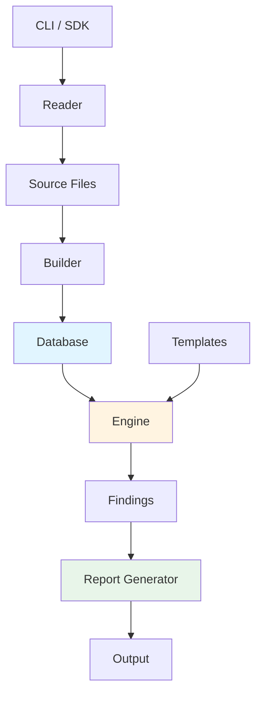

# W3GoAudit Project Overview

## Introduction

**W3GoAudit** is a Go-based static analysis engine for Solidity smart contracts. It combines AST parsing, inheritance resolution, call graph analysis, and a powerful query language (WQL) to detect security vulnerabilities and code quality issues.

**Key Features:**
- AST-based Solidity parsing via [solast-go](https://github.com/th13vn/solast-go)
- Recursive import resolution with remapping support
- C3 linearization for proper inheritance resolution
- Comprehensive call graph with recursive tracing
- Per-function effects analysis (state writes, guards, access control)
- WQL template-based vulnerability detection
- Result-folder output: `overview.md`, `findings.md`, `results.sarif`, `run.log`, a machine-readable `corpus/`, and per-main-contract workflow files + a state-change matrix; opt-in HTML mirror
- Self-provisioning template home (`~/.w3goaudit`) with release download + embedded fallback
- Project framework detection (Foundry, Hardhat, Truffle)

---

## What It Does

### Core Capabilities

**1. Contract Database Construction**
- Parses Solidity source files into a structured database
- Resolves inheritance hierarchies using C3 linearization
- Calculates function selectors (4-byte keccak256)
- Builds call graphs tracking all function invocations
- Identifies main contracts and entry points

**2. Security Analysis**
- Executes user-defined WQL templates against the database
- Detects patterns like reentrancy, access control issues, dangerous calls
- Supports taint analysis for tracking user-controlled input, including
  context-sensitive propagation through internal helper calls
- Recursively traces internal call chains from entry points to security sinks
- Generates findings with severity and confidence levels

**3. Reporting**
- A single opinionated **result folder** per scan (overview, findings, SARIF, run.log, JSON corpus)
- Per-entry-function workflow files (signature, auth, guards, branch conditions, state effects, call workflow)
- A per-contract state-change matrix (state var → writers → reaching entry points)
- Console output with color-coded severity and reachability traces
- Opt-in HTML mirror with interactive visualizations

---

## Architecture

### High-Level Design



### Package Structure

```
w3goaudit/
├── cmd/
│   └── w3goaudit/          # CLI entry point (Cobra-based)
│       ├── main.go         # Entry: rootCmd.Execute()
│       ├── root.go         # The scan command (progress → summary → result folder)
│       ├── build.go        # Build subcommand
│       ├── extract.go      # Extract subcommand (11 sub-subcommands)
│       ├── scan_filters.go # Template loading/precedence + severity/include/exclude filters
│       ├── config_cli.go   # Apply ~/.w3goaudit config defaults; --update-templates
│       ├── update.go       # --update (go install …@latest self-update)
│       ├── completion.go   # Shell completion generation
│       └── helpers.go      # Shared utilities (result-folder path, run.log, DB loading)
│
├── pkg/
│   ├── reader/             # File discovery and loading
│   │   ├── reader.go       # Recursive .sol file discovery
│   │   ├── project.go      # Project root detection
│   │   ├── resolver.go     # Import path resolution
│   │   └── git.go          # Git repository detection and URL building
│   │
│   ├── builder/            # Database construction
│   │   ├── builder.go      # 7-phase build orchestration
│   │   ├── contract.go     # Contract extraction from AST
│   │   ├── ast_builder.go  # Function AST tree building
│   │   ├── semantic.go     # Lightweight semantic type facts
│   │   ├── inheritance.go  # C3 linearization
│   │   ├── callgraph.go    # Call graph construction
│   │   └── effects.go      # Phase 7: per-function effects (writes/guards/auth)
│   │
│   ├── engine/             # Template execution
│   │   ├── engine.go       # Query execution engine
│   │   ├── template.go     # Template loading, parsing, normalization
│   │   ├── verify.go       # WQL rule verification (recursive Verify)
│   │   └── presets.go      # Built-in presets (unAuthenticated, unCheckedSender, unLocked)
│   │
│   ├── home/               # ~/.w3goaudit config + template home
│   │   └── home.go         # config.yml load/init, release download (zipball), --update-templates
│   │
│   ├── types/              # Core data structures
│   │   ├── database.go     # Contract database + MainContractEntry
│   │   ├── contract.go     # Contract representation
│   │   ├── function.go     # Function with selectors + access control helpers
│   │   ├── ast.go          # AST node structures + semantic group helpers
│   │   ├── semantic.go     # TypeInfo, SemanticFacts, SemanticSymbol
│   │   ├── callgraph.go    # Call graph types
│   │   └── dataflow.go     # Data flow graph types
│   │
│   ├── report/             # Output formatting
│   │   ├── bundle.go       # Result-folder writer (overview/findings/SARIF/corpus, per-contract dirs)
│   │   ├── state_matrix.go # State-change matrix (writers + reachable entry points)
│   │   ├── generator.go    # Summary report generation (with git detection)
│   │   ├── markdown.go     # Markdown formatter (git URL links)
│   │   ├── html.go         # HTML with Mermaid diagrams (git URL links)
│   │   ├── sarif.go        # SARIF 2.1.0 formatter
│   │   ├── code_extract.go # Source code extraction
│   │   ├── scan_formats.go # Findings formatting (Markdown + HTML)
│   │   └── summary.go      # Project statistics and GitInfo
│   │
│   └── types/              # Core data structures (see above)
│
├── templates/              # WQL detection templates (embed.go embeds official/)
│   ├── official/              # Curated pack, embedded as the default
│   └── test/                  # Engine feature-exercise templates
├── test-data/              # Test contracts (core/, security/)
└── docs/                   # Documentation
    ├── workflows.md        # Internal workflow details
    ├── usage.md            # CLI and SDK usage
    ├── wql-syntax.md       # Template language reference
    └── project-overview.md # This file
```

---

## Key Components

### 1. Reader Package

**Responsibility:** Discover and load Solidity source files.

**Features:**
- Recursive directory traversal
- Automatic exclusion of build/test directories
- Recursive import resolution
- Project root detection
- Framework identification (Foundry/Hardhat/Truffle)
- Remapping support for dependency resolution
- Path canonicalization (`EvalSymlinks` + `Clean`) so symlink/relative
  aliases don't double-load the same file
- UTF-8 BOM stripping so pragma/import regexes work on BOM-prefixed sources

**Entry Point:** `reader.New().Read(path)` then `reader.ResolveImports(projectRoot)`

**Code:** [pkg/reader/](../pkg/reader)

---

### 2. Builder Package

**Responsibility:** Parse AST and construct the contract database.

**Build Phases:**

1. **Parse Files** - Extract contracts, functions, state vars from AST
2. **Build ASTs & Semantic Facts** - Create simplified AST trees for function
   bodies, intra-procedural data flow, and lightweight type facts for symbols,
   casts, and call receivers
3. **Calculate Selectors** - Generate function signatures and selectors
4. **Build Inheritance** - Apply **canonical** C3 linearization (forward-order
   "no-tail" merge over the reversed base list — the MRO solc computes, not a
   divergence-prone heuristic; cycle-safe — `A is B; B is A` errors out instead
   of panicking). Bases are resolved scope-aware via `ResolveContractName`, so a
   duplicate contract name (real vs mock) picks the in-scope definition.
5. **Build Call Graph** - Resolve all function calls (deterministic iteration
   order). A post-pass (`ResolveSuperAcrossLeaves`) makes `super` resolution
   context-aware: `super.f()` binds against the linearization of the most-derived
   contract being instantiated, so each super call is bound to the next definition
   in **every** instantiation leaf's MRO (sound union, additive + deduplicated),
   not just the textual contract's own MRO. This closes a reachability
   false-negative on cooperative-diamond `super` chains.
6. **Calculate Entry Points** - Identify main contracts and public/external functions
7. **Analyze Per-Function Effects** - Walk each function's AST and record durable
   `FunctionEffects`: the state variables it writes (with write kind), its guards
   (`require`/`assert`/`revert` and `if`/ternary branch conditions), and its auth
   facts (modifiers, inline `msg.sender` checks, `tx.origin` use, controlled vs
   unprotected). These feed `state-changes.md` and the per-entry workflow files.
   Implementation: [pkg/builder/effects.go](../pkg/builder/effects.go)

The Yul classifier in phase 2 now recognizes `create`, `create2`, `log0`–`log4`,
`revert`, and `return` opcodes in addition to the original
`call`/`delegatecall`/`staticcall`/`sstore`/`sload`/`selfdestruct` set.

The phase 2 semantic layer stores `TypeInfo` in `Database.Semantics` and mirrors
relevant facts onto AST node attributes (`type_kind`, `receiver_type_kind`,
etc.). WQL templates can use those attributes without more syntax, and call
classification can distinguish primitive-address ETH transfers from
interface/contract methods with the same names.

**Entry Point:** `builder.New().Build(sources)`

**Code:** [pkg/builder/](../pkg/builder)

---

### 3. Engine Package

**Responsibility:** Execute WQL templates to find vulnerabilities.

**Capabilities:**
- Load YAML templates with full load-time validation:
  required metadata, rule-placement (`filter:` vs `match:`), regex validity,
  known presets, known kinds. Directory loading fails closed by default; use
  `--ignore-invalid-templates` only for ad-hoc mixed rule folders.
- Parse WQL syntax (all/any/not/seq/has/inside) with bounded recursion
  (`MaxRuleRecursionDepth = 64`)
- Recursive `arg.N` constraint propagation through nested rules
- Process-wide compiled-regex cache
- Verify match rules against functions/contracts
- Taint analysis for parameters, state variables, locals, indexed expressions,
  and local aliases, computed as a **bounded dataflow fixpoint**
  (`MaxTaintFixpointPasses = 8`) so chained and loop-carried aliases converge
  while strong updates preserve sender-vs-parameter precision (flow-sensitive,
  not path-sensitive)
- Context-sensitive internal-call taint: `_helper(from)` keeps the callee
  parameter user-controlled, while `_helper(msg.sender)` is treated as sender
  identity rather than arbitrary user input
- `sequence` is control-flow aware via branch-arm exclusivity: matches in the
  `then`/`else` of an `if`, the two arms of a ternary, or the body vs a `catch`
  clause of a `try/catch` cannot form a sequence (not a full CFG — loops stay
  straight-line)
- Recursive internal call tracing from entrypoints with a bounded depth guard
  (`MaxInterproceduralTaintDepth = 12`)
- Generate findings with locations
- Transactional matched-node attribution: failed candidate branches roll back
  provisional `PrimaryAST` capture, so reports point at the node that actually
  satisfied the rule.

**Thread-safety:** `Engine` is **not safe for concurrent use** — it carries
per-scan context fields. SDK callers wanting parallelism must allocate one
engine per goroutine.

**Entry Point:** `engine.New(db).Execute(template)`

**Code:** [pkg/engine/](../pkg/engine)

---

### 4. Types Package

**Responsibility:** Define core data structures.

**Key Types:**

```go
// Database - Complete project representation
type Database struct {
    ProjectRoot   string
    Contracts     map[string]*Contract
    SourceFiles   map[string]*SourceFile
    MainContracts map[string]*MainContractEntry  // contractID → entry with funcs + linearization
    CallGraph     *CallGraph
    DataFlow      *DataFlowGraph  // intra-procedural assignments + param bindings
    Semantics     *SemanticFacts   // lightweight type/symbol facts
    Framework     string
}

type MainContractEntry struct {
    EntryFunctions  []string  // resolved entry function IDs (absPath#ContractName.selector)
    LinearizedBases []string  // C3 linearization (most derived first)
}

// Contract - Single contract/interface/library
type Contract struct {
    Name             string
    Kind             string  // contract, interface, library, abstract
    SourceFile       string
    Functions        []*Function
    StateVariables   []*StateVariable
    Structs          []*Struct
    Events           []*Event
    Modifiers        []*Modifier
    BaseContracts    []string
    LinearizedBases  []string  // C3 linearization (most derived first)
    InheritanceWeight int
    IsAbstract       bool
}

// Function - Function with AST and call graph
type Function struct {
    Name            string
    ContractName    string
    Visibility      Visibility       // public, external, internal, private
    StateMutability StateMutability  // pure, view, payable, nonpayable
    Modifiers       []string
    Parameters      []*Parameter
    Returns         []*Parameter
    Selector        string  // e.g., "transfer(address,uint256)"
    Signature       string  // 4-byte hex keccak256 of selector
    AST             *ASTNode
    Calls           []*FunctionCall
    StartLine       int
    EndLine         int
}
```

**Code:** [pkg/types/](../pkg/types)

---

### 5. Report Package

**Responsibility:** Format results and write the scan **result folder**.

**Result folder** (`report.WriteBundle`, [pkg/report/bundle.go](../pkg/report/bundle.go)):
- `overview.md`, `findings.md` — human-readable Markdown
- `results.sarif` — SARIF 2.1.0 (always)
- `corpus/{database.json,findings.json,overview.json}` — machine-readable; the
  canonical database lives only here (reusable via `--db`)
- `<MainContract>/state-changes.md` — per-contract state-change matrix built by
  [pkg/report/state_matrix.go](../pkg/report/state_matrix.go): each state variable,
  the functions that write it, and the entry points that reach a writer (reverse
  call-graph walk)
- `<MainContract>/workflows/<entryFn>.md` — one self-contained context block per
  entry function (signature, auth/access control, guards, branch conditions,
  transitive state effects, Mermaid call workflow)
- Folder/file names are sanitized; collisions are disambiguated with
  `Name__<filestem>` (contracts) and `<entryFn>__<selector>` (overloads); stale
  per-contract folders from a previous run are pruned on re-scan
- Opt-in `overview.html` + `findings.html` mirror (`--html`)

**Console:** color-coded summary header, findings grouped by severity with
reachability traces, an unresolved-references section, and the result-folder
location. `run.log` (written by the CLI) always captures full verbose detail.

**Code:** [pkg/report/](../pkg/report)

---

### 6. Home Package

**Responsibility:** Manage the cross-platform `~/.w3goaudit` directory — the user
config and the template home that mirrors the published template pack.

**Features:**
- First-run init: create `~/.w3goaudit`, write a default `config.yml`, and
  populate `templates/` from the latest release of `th13vn/w3goaudit-templates`
  (GitHub Releases **zipball**, nuclei-style — never `git clone`), recording the
  tag in `templates/.version`
- Graceful degradation: any download failure (offline, repo/release missing)
  falls back to the embedded official pack — no hard failure
- `config.yml` load with built-in defaults; every key is overridable by a CLI flag
- `UpdateTemplates` powers `--update-templates`; tool self-update (`--update`)
  lives in `cmd/w3goaudit/update.go` (runs `go install …@latest`)

**Template precedence:** `--template` > `~/.w3goaudit/templates/` (when populated)
> embedded official pack.

**Code:** [pkg/home/](../pkg/home)

---

## Design Decisions

### Why C3 Linearization?

**Problem:** Solidity uses C3 linearization for method resolution order (MRO).

**Solution:** We implement the same algorithm to:
- Correctly resolve inherited functions
- Determine final implementation of virtual functions
- Match Solidity compiler behavior
- Accurately identify entry points

**Implementation:** [pkg/builder/inheritance.go](../pkg/builder/inheritance.go)

**Reference:** [Solidity Inheritance](https://docs.soliditylang.org/en/latest/contracts.html#inheritance)

---

### Why AST-Based Analysis?

**Alternative:** Regex-based source code scanning.

**Advantages of AST:**
- **Semantic understanding** - Know what code means, not just text
- **Context-aware** - Distinguish variables from function names
- **Traversal capabilities** - Navigate parent/child relationships
- **Type information** - Function signatures, modifiers, visibility
- **Call graph** - Track function invocations accurately

**Trade-offs:**
- More complex implementation
- Requires parser (we use [solast-go](https://github.com/th13vn/solast-go))
- Higher memory usage

**Conclusion:** AST provides significantly better accuracy and fewer false positives.

---

### Why Template-Driven Approach?

**Alternative:** Hard-coded vulnerability detectors.

**Advantages of Templates:**
- **Extensible** - Users can write custom rules
- **Declarative** - Describe *what* to find, not *how*
- **Maintainable** - Rules in YAML, not code
- **Shareable** - Templates can be published and reused
- **Versionable** - Templates tracked separately from engine

**Trade-offs:**
- Query language design complexity
- Performance overhead for interpretation

**Conclusion:** Flexibility and user empowerment outweigh performance costs.

---

### Entry Point Calculation Strategy

**Challenge:** Identify which functions are externally callable.

**Solution:**
1. Identify **main contracts** (deployable, ranked by inheritance depth)
2. Find **public/external functions** in main contracts
3. **Resolve through inheritance** to find actual implementation
4. Create function ID mapping: `contractID -> [functionIDs]`

**Why not all public/external functions?**
- Libraries and interfaces aren't deployed
- Abstract contracts can't be instantiated
- We focus on real attack surface

**Implementation:** [pkg/types/database.go:CalculateMainContracts](../pkg/types/database.go)

---

### Recursive External Call Tracing

**Challenge:** Detect external calls made through internal function chains.

**Example:**
```solidity
function withdraw() public {      // Entry point
    _processWithdraw();           // Internal call
}

function _processWithdraw() internal {
    token.transfer(msg.sender);   // External call here!
}
```

**Solution:** When checking for external calls, recursively follow internal calls.

**Algorithm:**
1. Check function AST for direct external calls
2. Iterate through internal calls in call graph
3. Recursively check target functions
4. Use visited set to prevent infinite loops

**Implementation:** [pkg/engine/engine.go:tracesExternalCall](../pkg/engine/engine.go#L213-L278)

---

## Current Features

### Implemented

**File Reading**
- Recursive directory traversal
- Project framework detection
- **Import path resolution with remapping**
- **Recursive dependency loading**

**AST Parsing**
- Integration with solast-go
- Contract, function, state variable extraction
- Tolerant parsing mode

**Database Building**
- C3 linearization
- Function selector calculation
- Call graph construction
- Entry point identification

**WQL Query Language**
- Query structure: `filter:` (function/contract-level preconditions) + `match:` (AST pattern)
- Logic operators: all, any, not, sequence
- Traversal: contains (descendants), inside (ancestors)
- Atomic matchers: kind, regex name, attr
- Filter helpers: modifier, extends, func_name, visibility_filter, mutability_filter, has_guard, version, has_param
- Taint analysis: parameter/state_var/local_var source tracking
- Call-specific: `args: {0: ...}` or flat `arg.N:` keys
- Semantic groups: outgoing_call, eth_transfer, delegatecall, check/guard, token_call, state_write/state_read, selfdestruct
- Presets: unAuthenticated, unCheckedSender, unLocked

**Extract Subcommands (11 total)**
- Canonical order widest→narrowest: `main`, `entry`, `inheritance`, `statevar`, `selector`, `involve`, `workflow`, `bundle`, `context`, `source`, `diff`
- `source` — raw Solidity source lines for a named function
- `context` — combined context bundle (source + call edges + state vars + inheritance)
- `workflow` — full transitive source for an entry function (BFS call graph, report-ready)
- Output defaults to **Markdown**; every subcommand except `diff` accepts an optional
  trailing source `[path]` to build the database on the fly, so `--db` is not strictly required


**Reporting**
- One **result folder** per scan: `overview.md`, `findings.md`, always-on
  `results.sarif` + `run.log`, a `corpus/` (database.json + findings.json +
  overview.json), and one sub-folder per main contract
- Per-entry workflow files (signature, auth, guards, branches, state effects,
  call workflow) and a per-contract state-change matrix
- Console with severity icons and reachability traces
- Opt-in HTML mirror (`--html`) with interactive vis.js call graphs
- **Reachability-aware findings** — every finding can carry the call chain
  from an externally-callable entry down to the function that hosts the
  dangerous statement. Formats:
  - **Console**: `↳ via Contract.entry() ⇒ … ⇒ host()` + `↳ fix-here: …`
  - **JSON** (`corpus/findings.json`): structured `reachability.steps[]`, `entryPoint`, `primaryAst`
  - **SARIF 2.1.0**: `result.relatedLocations[]` per hop +
    `result.properties.entryPoint` / `result.properties.primaryAst`
  - **Markdown / HTML**: per-occurrence trace block with dotted-level
    indentation (`.`, `..`, `...`) and line numbers per hop
- Bug location is hardcoded to the best provenance: the dangerous-node
  `file:line:col` anchor plus the reachability chain and fix-here pointer

**Configuration & Distribution**
- `~/.w3goaudit/config.yml` (defaults overridable by flags), managed by `pkg/home`
- Self-provisioning template home with release download + embedded fallback;
  `--update-templates` refreshes it
- `--update` self-updates the tool via `go install …@latest`

**CLI**
- The scan is the root command (no `scan` subcommand); build, extract, completion, version
- Long + short forms for every scan flag
- Folder-based output (Markdown + SARIF + JSON corpus)
- Database caching via JSON files (reuse `corpus/database.json` with `--db`)
- Verbose terminal mode; full detail always captured in `run.log`

**SDK**
- Go library for integration
- Builder, Engine, Report APIs
- Database caching (load/save JSON)
- Debug writer configuration

---

## Roadmap

### Planned Features

#### 🔜 Short Term

**Repository Scanning**
- Clone and scan GitHub repositories
- Support for specific branches/commits
- Batch scanning of multiple repos

**On-Chain Contract Fetching**
- Etherscan API integration
- Fetch verified contract source
- Multi-chain support (Ethereum, Polygon, BSC, etc.)

**Enhanced Detection**
- State change after external call (precise CEI checking)
- Data flow analysis for more complex taint tracking
- Storage slot collision detection

#### 🔮 Long Term

**Query Language Enhancements**
- `all_paths` operator - Check all execution paths
- `data_flow` - Track variable transformations
- `storage` - Storage layout analysis
- Custom functions in templates

**Visualization**
- Export call graphs to Mermaid, DOT, PlantUML
- Interactive web UI for exploring results
- Dependency graphs
- State machine diagrams

**IDE Integration**
- Language Server Protocol (LSP) support
- Real-time linting in VSCode/Vim/etc.
- Inline diagnostics
- QuickFix suggestions

**Performance**
- Parallel file parsing
- Incremental builds (only reparse changed files)
- Database caching
- Stream processing for large projects

**Template Ecosystem**
- Template marketplace/repository
- Automated template testing
- Template quality scoring
- Standard library of common patterns

---

## Development

### Building

```bash
# Build binary
go build -o w3goaudit ./cmd/w3goaudit

# Run tests
go test ./pkg/...

# Integration test: scan (root command, no 'scan' subcommand)
./w3goaudit test-data/security/ --template templates/official/ --verbose

# Integration test: build database
./w3goaudit build test-data/core/build-database/ -o test-db.json --verbose

# Full scan → result folder
./w3goaudit test-data/security/ --template templates/official/ -o test-report/
```

### Adding New Features

**To add a new AST node kind:**
1. Add constant to [types/ast.go](../pkg/types/ast.go)
2. Update `BuildFunctionAST` in [builder/ast_builder.go](../pkg/builder/ast_builder.go)
3. Document in [WQL syntax guide](./wql-syntax.md)

**To add a new WQL operator:**
1. Add verification logic to [engine/verify.go](../pkg/engine/verify.go)
2. Update template parsing if needed
3. Add tests in [engine/verify_test.go](../pkg/engine/verify_test.go)
4. Document in [WQL syntax guide](./wql-syntax.md)

**To add a new CLI command or flag:**
1. Add flag to `cmd/w3goaudit/root.go` (for root scan) or create a new file in `cmd/w3goaudit/`
2. Register with `rootCmd.AddCommand()` in `root.go`'s `init()`
3. Document in [docs/usage.md](./usage.md) and [README](../README.md)

---

## Testing

### Test Structure

```
test-data/
├── security/               # Security detection fixtures (paired with templates/official/)
│   └── *.sol               # general + promoted-detector fixtures
│
└── core/                   # Core pipeline / tool fixtures (not security detection)
    ├── build-database/     # Parser + builder tests (01-..10-)
    ├── engine-features/    # WQL engine operator tests (paired with templates/test/)
    └── extract/            # CLI `extract` demo fixture (defi-vault.sol)
```

### Running Tests

```bash
# Unit tests
go test ./pkg/...

# Integration test: Build database
./w3goaudit build test-data/core/build-database/ -o test-db.json --verbose

# Integration test: Security scan (root command = scan, no 'scan' subcommand)
./w3goaudit test-data/security/ \
  --template templates/official/ \
  -o test-report/
```

---

## Contributing

### Guidelines

1. **Follow Go conventions** - gofmt, golint
2. **Write tests** for new features
3. **Update documentation** in `docs/`
4. **Add examples** to `test-data/` when adding node kinds
5. **Create templates** in `templates/` for new vulnerability types

### Pull Request Process

1. Fork repository
2. Create feature branch
3. Implement changes with tests
4. Update relevant documentation
5. Submit PR with clear description

---

## Performance Characteristics

### Time Complexity

| Operation | Complexity | Notes |
|-----------|------------|-------|
| File Reading | O(n) | n = number of files |
| AST Parsing | O(m) | m = total source code size |
| C3 Linearization | O(k²) | k = number of bases (typically small) |
| Call Graph Building | O(f × c) | f = functions, c = calls per function |
| Template Execution | O(t × e × d) | t = templates, e = scope elements, d = AST depth |

### Memory Usage

**Typical project (50 contracts, 500 functions):**
- Database: ~10-20 MB
- AST trees: ~5-10 MB
- Call graph: ~1-2 MB
- **Total: ~20-30 MB**

**Large project (500 contracts, 5000 functions):**
- Database: ~100-200 MB
- **Total: ~200-300 MB**

### Optimization Opportunities

- Parallel parsing (currently sequential)
- AST streaming (reduce memory for large functions)
- Call graph pruning (remove unreachable code)
- Template caching (compile regex once)

---

## Dependencies

### Direct Dependencies

- **solast-go** — Solidity AST parser
  - https://github.com/th13vn/solast-go
  - Used for parsing Solidity source into AST

- **yaml.v3** — YAML parsing for WQL templates
  - gopkg.in/yaml.v3

- **cobra** — CLI framework
  - github.com/spf13/cobra


### Standard Library

- `encoding/json` — JSON marshaling for database export
- `regexp` — Regular expression matching in WQL rules
- `crypto/sha3` — Keccak256 for function selectors
- `path/filepath` — File path manipulation

---

## License

MIT License

---

## Related Documentation

- [Workflows](./workflows.md) - Detailed internal workflows
- [Usage Guide](./usage.md) - CLI and SDK usage
- [WQL Syntax](./wql-syntax.md) - Template language reference
- [README](../README.md) - Quick start guide
