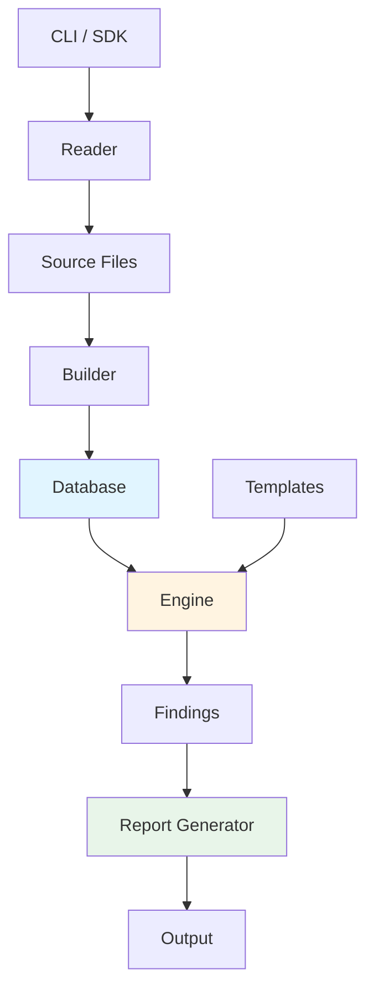

# W3GoAudit Project Overview

## Introduction

**W3GoAudit** is a Go-based static analysis engine for Solidity smart contracts. It combines AST parsing, inheritance resolution, call graph analysis, and a powerful query language (WQL) to detect security vulnerabilities and code quality issues.

**Key Features:**
- AST-based Solidity parsing via [solast-go](https://github.com/th13vn/solast-go), with precise source
  locations on both AST nodes and declarations: one-based Unicode-code-point
  columns and zero-based half-open UTF-8 byte offsets. These are not LSP
  positions, whose lines and characters are zero-based and commonly UTF-16.
- Recursive import resolution with remapping support
- Durable source/build diagnostics with source-cache parity and optional
  fail-closed imports (`--strict-imports`)
- Exact `file#Contract` / `file#Contract.selector(types)` identities throughout
  inheritance, call graphs, extraction, reports, and navigation
- C3 linearization for proper inheritance resolution
- Comprehensive call graph with recursive tracing
- Per-function effects analysis (state writes, guards, access control)
- WQL template-based vulnerability detection (`meta` plus one `query:` block)
- Result-folder output: `overview.md`, `findings.md`, `results.sarif`, `run.log`, a machine-readable `data/`
  (including extension-facing `nav.json`/`explorer.json`), and per-main-contract workflow files + a
  state-change matrix; opt-in HTML mirror
- Self-provisioning template home (`~/.w3goaudit`) with release download + embedded fallback
- Project framework detection (Foundry, Hardhat, Truffle)

---

## What It Does

### Core Capabilities

**1. Contract Database Construction**
- Parses Solidity source files into a structured database
- Resolves inheritance hierarchies using C3 linearization
- Stores canonical function text in `Function.Selector` and its four-byte
  Keccak value in `Function.Signature`
- Builds call graphs tracking all function invocations
- Identifies main contracts and entry points

**2. Security Analysis**
- Executes user-defined WQL templates against the database. The strict loader
  rejects `select`/`from`/`where` outside the required `query:` block.
- Detects patterns like reentrancy, access control issues, dangerous calls
- Supports taint analysis for tracking user-controlled input, including
  context-sensitive propagation through internal helper calls
- Recursively traces internal call chains from entry points to security sinks
- Generates findings with severity and confidence levels, anchored to precise
  file/line/column/byte locations

**3. Reporting**
- A single opinionated **result folder** per scan (overview, findings, SARIF, run.log, JSON data/)
- `overview.md` is the report index and links to detailed artifacts
- Per-entry-function workflow files (signature, auth, guards, branch conditions, state effects, call workflow)
- A per-contract state-change matrix (state var → writers → reaching entry points)
- An extension-facing data layer — `data/nav.json` (symbol navigation index) and
  `data/explorer.json` (per-contract explorer model) — for a future VSCode Solidity extension
- Console output with color-coded severity and reachability traces
- Opt-in HTML mirror with interactive visualizations

---

## Architecture

### High-Level Design



### Package Structure

```
w3goaudit/
├── cmd/
│   └── w3goaudit/          # CLI entry point (Cobra-based)
│       ├── main.go         # Entry: rootCmd.Execute()
│       ├── root.go         # The scan command (progress → summary → result folder)
│       ├── scan_options.go # Immutable scan options + source/cache strict-import policy
│       ├── build.go        # Build subcommand
│       ├── extract.go      # Extract subcommand (11 sub-subcommands)
│       ├── scan_filters.go # Template loading/precedence + severity/include/exclude filters
│       ├── config_cli.go   # Apply ~/.w3goaudit config defaults; --update-templates
│       ├── update.go       # --update (go install …@latest self-update)
│       ├── completion.go   # Shell completion generation
│       └── helpers.go      # Shared utilities (result-folder path, run.log, DB loading)
│
├── pkg/
│   ├── logging/            # Immutable scan-local logger (serialized writes)
│   ├── reader/             # File discovery and loading
│   │   ├── reader.go       # Recursive .sol file discovery
│   │   ├── imports.go      # Solidity-aware import directive lexer
│   │   ├── remappings.go   # Foundry TOML/profile/context remapping logic
│   │   ├── project.go      # Project root detection
│   │   ├── resolver.go     # Import path resolution
│   │   └── git.go          # Git repository detection and URL building
│   │
│   ├── builder/            # Database construction
│   │   ├── builder.go      # 7-phase build orchestration
│   │   ├── contract.go     # Contract extraction from AST
│   │   ├── ast_builder.go  # Function AST tree building
│   │   ├── location.go     # Unicode columns / UTF-8 byte-range index
│   │   ├── parser_input.go # Assembly-only := compatibility normalization
│   │   ├── semantic.go     # Lightweight semantic type facts
│   │   ├── inheritance.go  # C3 linearization
│   │   ├── callgraph.go    # Call graph construction
│   │   └── effects.go      # Phase 7: per-function effects (writes/guards/auth)
│   │
│   ├── engine/             # Template execution
│   │   ├── engine.go       # Query execution engine
│   │   ├── template.go     # Template loading, parsing, normalization
│   │   ├── wql.go          # WQL parser + lowering to evaluator Rule IR
│   │   ├── wql_catalog.go  # WQL block-kind/attribute/preset name tables
│   │   ├── verify.go       # WQL rule verification (recursive Verify)
│   │   └── presets.go      # Built-in property presets
│   │
│   ├── home/               # ~/.w3goaudit config + template home
│   │   └── home.go         # config.yml load/init, release download (zipball), --update-templates
│   │
│   ├── types/              # Core data structures
│   │   ├── database.go     # Contract database + MainContractEntry
│   │   ├── diagnostic.go   # Durable analysis-quality diagnostics
│   │   ├── contract.go     # Contract representation
│   │   ├── function.go     # Function with selectors + access control helpers
│   │   ├── ast.go          # AST node structures + semantic group helpers
│   │   ├── semantic.go     # TypeInfo, SemanticFacts, SemanticSymbol
│   │   ├── callgraph.go    # Call graph types
│   │   └── dataflow.go     # Data flow graph types
│   │
│   ├── report/             # Output formatting
│   │   ├── bundle.go       # Result-folder writer (overview/findings/SARIF/data, per-contract dirs)
│   │   ├── diagnostics.go  # data/diagnostics.json + counts/completeness
│   │   ├── manifest.go     # Complete result-folder machine index
│   │   ├── nav.go          # data/nav.json: symbol navigation index (defs, callers, interface→impl)
│   │   ├── explorer.go     # data/explorer.json: per-main-contract explorer model
│   │   ├── state_matrix.go # State-change matrix (writers + reachable entry points)
│   │   ├── generator.go    # Summary report generation (with git detection)
│   │   ├── markdown.go     # Markdown formatter (git URL links)
│   │   ├── html.go         # HTML with Mermaid diagrams (git URL links)
│   │   ├── sarif.go        # SARIF 2.1.0 formatter
│   │   ├── code_extract.go # Source code extraction
│   │   ├── scan_formats.go # Findings formatting (Markdown + HTML)
│   │   └── summary.go      # Project statistics and GitInfo
│   │
│   └── types/              # Core data structures (see above)
│
├── templates/              # WQL detection templates (embed.go embeds official/)
│   ├── official/           # 25 curated WQL detectors, embedded as the default
│   └── test/               # 5 WQL engine feature-exercise templates
├── benchmarks/             # Docker Compose benchmark
│   ├── compose.yaml        # Only supported host entry point
│   ├── run_benchmark.py    # CLI and sequential orchestration
│   ├── benchmark_core.py   # Paths, indexes, process I/O, aliases, manifests
│   ├── benchmark_adapters.py # Scanner commands + native-output normalization
│   ├── benchmark_scoring.py  # Exact/relaxed matching and metrics
│   ├── benchmark_reporting.py # benchmark.md rendering
│   ├── call_chain.py       # Internal-call reachability helper
│   ├── assert_thresholds.py # Release-quality threshold gate
│   ├── templates/          # 76 WQL benchmark detector ports
│   ├── corpus/             # Active answer keys + registry
│   ├── fixtures/           # Split benchmark-family Solidity fixtures
│   └── results/            # Sole host output mount; generated/ignored
├── test-data/              # Test contracts (core/, security/)
└── docs/                   # Documentation
    ├── workflows.md        # Internal workflow details
    ├── usage.md            # CLI and SDK usage
    ├── wql-syntax.md       # WQL template language reference
    ├── extension-output.md # data/nav.json + data/explorer.json schema
    └── project-overview.md # This file
```

---

## Key Components

### 1. Reader Package

**Responsibility:** Discover and load Solidity source files.

**Features:**
- Recursive directory traversal
- Automatic exclusion of build/test directories
- Recursive import resolution
- Project root detection
- Framework identification (Foundry/Hardhat/Truffle)
- Remapping support for dependency resolution
- Solidity-aware import parsing ignores comments/string lookalikes and decodes
  valid Solidity string escapes before filesystem resolution
- Foundry remappings honor the active `FOUNDRY_PROFILE`, optional context,
  longest applicable context/prefix, and continue to later mappings/fallbacks
  when a candidate target is missing or not a regular file
- Canonical `ResolvedImports` provenance is persisted for exact identity after
  database-cache round-trips
- Occurrence-level `ImportBindings` preserve raw/canonical paths plus named and
  namespace aliases, including repeated imports with different local names
- Path canonicalization (`EvalSymlinks` + `Clean`) so symlink/relative
  aliases don't double-load the same file
- UTF-8 BOM stripping so pragma/import regexes work on BOM-prefixed sources

**Entry Point:** `reader.New().Read(path)` then `reader.ResolveImports(projectRoot)`

**Code:** [pkg/reader/](../pkg/reader)

---

### 2. Builder Package

**Responsibility:** Parse AST and construct the contract database.

**Build Phases:**

1. **Parse Files** - Extract contracts, functions, state vars from AST
2. **Build ASTs & Semantic Facts** - Create simplified AST trees for function
   bodies, intra-procedural data flow, and lightweight type facts for symbols,
   casts, and call receivers. Solidity `for` children use runtime order:
   initialization, condition, body, then post.
3. **Calculate Selectors** - Store canonical text such as
   `transfer(address,uint256)` in `Function.Selector` and its four-byte Keccak
   value in `Function.Signature`
4. **Build Inheritance** - Apply **canonical** C3 linearization (forward-order
   "no-tail" merge over the reversed base list — the MRO solc computes, not a
   divergence-prone heuristic; cycle-safe — `A is B; B is A` errors out instead
   of panicking). `LinearizedBaseIDs` stores exact `file#Contract` identities;
   ambiguous bases remain unresolved and diagnostic instead of being guessed.
   Exact lookup consumes serialized import bindings, so `Parent` and `V.Base`
   resolve only in the canonical imported source.
5. **Build Call Graph** - Resolve all function calls (deterministic iteration
   order). A post-pass (`ResolveSuperAcrossLeaves`) makes `super` resolution
   context-aware: `super.f()` binds against the linearization of the most-derived
   contract being instantiated, so each super call is bound to the next definition
   in **every** instantiation leaf's MRO (sound union, additive + deduplicated),
   not just the textual contract's own MRO. This closes a reachability
   false-negative on cooperative-diamond `super` chains.
   Parsed calls with known arity never resolve a same-name declaration of the
   wrong arity; exact target fields remain empty and one durable
   `identity.unresolved` diagnostic records the observed arity.
6. **Calculate Entry Points** - Identify main contracts and public/external
   functions, deduplicating active inherited implementations by canonical
   selector so the most-derived override wins while overloads remain distinct
7. **Analyze Per-Function Effects** - Walk each function's AST and record durable
   `FunctionEffects`: the state variables it writes (with write kind), its guards
   (`require`/`assert`/`revert` and `if`/ternary branch conditions), and its auth
   facts (modifiers, inline `msg.sender` checks, `tx.origin` use, controlled vs
   unprotected). These feed `state-changes.md` and the per-entry workflow files.
   Implementation: [pkg/builder/effects.go](../pkg/builder/effects.go)

The Yul classifier in phase 2 now recognizes `create`, `create2`, `log0`–`log4`,
`revert`, and `return` opcodes in addition to the original
`call`/`delegatecall`/`staticcall`/`sstore`/`sload`/`selfdestruct` set.

The phase 2 semantic layer stores `TypeInfo` in `Database.Semantics` and mirrors
relevant facts onto AST node attributes (`type_kind`, `receiver_type_kind`,
etc.). WQL templates can use those attributes without more syntax, and call
classification can distinguish primitive-address ETH transfers from
interface/contract methods with the same names.

**Entry Point:** `builder.New().Build(sources)`

**Code:** [pkg/builder/](../pkg/builder)

---

### 3. Engine Package

**Responsibility:** Execute WQL templates to find vulnerabilities.

**Capabilities:**
- Load YAML templates as **WQL** (`meta` plus `query:` — `select`/`from`/
  `where` or a query-level `and:`/`or:` composition; all 106 official,
  benchmark, and feature-test templates use it). Unknown keys at any level
  are rejected by the strict parser. `TemplateDoc.lower()`
  (`pkg/engine/wql.go`) compiles the document into evaluator `Rule` IR
  before matching, taint, and reachability run. Full load-time validation includes:
  required metadata, rule-placement (`filter:` vs `match:`), regex validity,
  known presets, known kinds. Directory loading fails closed by default; use
  `--ignore-invalid-templates` only for ad-hoc mixed rule folders.
- Require every query-level `and:` branch to expose a positive reportable
  anchor and traceable AST evidence; absence-only and regex-only branches fail
  at load, while regex may refine an AST-anchored branch. Select-less sequences
  require positive actionable evidence in their first step.
- Parse WQL logic (`and`/`any`/`not`/`sequence`/`has`/`in`) with bounded recursion
  (`MaxRuleRecursionDepth = 64`), including supported nested `Attr` maps/slices;
  cycles and depth 65 fail closed while shared DAGs remain valid
- Recursive `arg.N` constraint propagation through nested rules
- Process-wide compiled-regex cache
- Verify match rules against functions/contracts
- Taint analysis for parameters, state variables, locals, indexed expressions,
  and local aliases, computed as a **bounded dataflow fixpoint**
  (`MaxTaintFixpointPasses = 8`) so chained and loop-carried aliases converge
  while strong updates preserve sender-vs-parameter precision (flow-sensitive,
  not path-sensitive)
- Context-sensitive internal-call taint: `_helper(from)` keeps the callee
  parameter user-controlled, while `_helper(msg.sender)` is treated as sender
  identity rather than arbitrary user input
- Caller identity recognizes only `msg.sender`, `tx.origin`, and an exact
  zero-argument internal `_msgSender()` helper. Same-named identifiers,
  external calls, unresolved calls, and nonzero overloads retain their normal
  provenance.
- `sequence` uses an execution-event partial order: statements retain source
  order; call preludes and non-call operand/value expressions precede their
  enclosing effect; calls precede inlined callees; distinct pre-effect siblings
  remain unordered. Nested receiver/option calls are recorded once in the
  callgraph. It is also control-flow aware
  via branch-arm exclusivity: matches in the
  `then`/`else` of an `if`, the two arms of a ternary, or the body vs a `catch`
  clause of a `try/catch` cannot form a sequence (not a full CFG — loops stay
  straight-line)
- Recursive internal call tracing from entrypoints with a bounded depth guard
  (`MaxInterproceduralTaintDepth = 12`)
- Contract-scope AST matching through a synthetic `decl.contract` root whose
  children retain exact contract, function, variable, parameter, and modifier
  declaration kinds and spans from the C3 linearized inheritance chain. Active
  functions are deduplicated by canonical selector, so the most-derived
  override wins while overloads remain distinct; same-contract combination
  rules can match local and inherited declarations without raw source regexes
- Generate findings with locations
- Transactional matched-node attribution: failed candidate branches roll back
  provisional `PrimaryAST` capture, so reports point at the node that actually
  satisfied the rule.
- Multi-site function and contract findings populate `Finding.Related`,
  including deterministic contract/file sites for positive synthetic roots,
  so reports show every labeled contributing branch rather than only the first
  match.

**Thread-safety:** `Engine` is **not safe for concurrent use** — it carries
per-scan context fields. SDK callers wanting parallelism must allocate one
engine per goroutine.

**Entry Point:** `engine.New(db).Execute(template)`

**Code:** [pkg/engine/](../pkg/engine)

---

### 4. Types Package

**Responsibility:** Define core data structures.

**Key Types:**

```go
// Database - Complete project representation
type Database struct {
    ProjectRoot   string
    ScanTarget    string
    Diagnostics   []Diagnostic
    Contracts     map[string]*Contract
    SourceFiles   map[string]*SourceFile
    MainContracts map[string]*MainContractEntry  // contractID → entry with funcs + linearization
    CallGraph     *CallGraph
    DataFlow      *DataFlowGraph  // intra-procedural assignments + param bindings
    Semantics     *SemanticFacts   // lightweight type/symbol facts
    Framework     string
}

type MainContractEntry struct {
    EntryFunctions    []string  // resolved exact function IDs
    LinearizedBases   []string  // compatibility/display names
    LinearizedBaseIDs []string  // exact C3 file#Contract identities
}

// Contract - Single contract/interface/library
type Contract struct {
    Name             string
    Kind             string  // contract, interface, library, abstract
    SourceFile       string
    Functions        []*Function
    StateVariables   []*StateVariable
    Structs          []*Struct
    Events           []*Event
    Modifiers        []*Modifier
    BaseContracts    []string
    LinearizedBases  []string  // compatibility/display names
    LinearizedBaseIDs []string // exact C3 identities, derived first
    InheritanceWeight int
    IsAbstract       bool
}

// Function - Function with AST and call graph
type Function struct {
    Name            string
    ContractName    string
    Visibility      Visibility       // public, external, internal, private
    StateMutability StateMutability  // pure, view, payable, nonpayable
    Modifiers       []string
    Parameters      []*Parameter
    Returns         []*Parameter
    Selector        string  // e.g., "transfer(address,uint256)"
    Signature       string  // 4-byte hex keccak256 of selector
    AST             *ASTNode
    Calls           []*FunctionCall
    StartLine       int
    EndLine         int
    StartCol        int  // 1-based Unicode-code-point column
    EndCol          int  // 1-based, half-open Unicode-code-point column
    StartByte       int  // 0-based UTF-8 byte offset
    EndByte         int  // 0-based, half-open UTF-8 byte offset
}
```

Precise locations flow end-to-end: solast-go (v0.1.7+) attaches column/byte
spans to every parsed node, the builder carries them onto `ASTNode`s and
declarations (interior statements/expressions are now located, not just
functions), `FunctionCall`/`CallEdge` add `Col`/`Byte`, and `pkg/report`
surfaces them in findings, SARIF, and the `nav.json`/`explorer.json`
navigation artifacts. Output schema bumped to `2.0.0` to reflect the added fields.
SARIF declares `columnKind: unicodeCodePoints`; it does not emit
`charOffset`/`charLength`, because those are character offsets rather than UTF-8
byte offsets.

**Code:** [pkg/types/](../pkg/types)

---

### 5. Report Package

**Responsibility:** Format results and write the scan **result folder**.

**Result folder** (`report.WriteBundle`, [pkg/report/bundle.go](../pkg/report/bundle.go)):
- `overview.md`, `findings.md` — human-readable Markdown
- `results.sarif` — SARIF 2.1.0 (always)
- `data/{database.json,findings.json,overview.json,diagnostics.json}` — machine-readable; the
  canonical database lives only here (reusable via `--db`)
- `data/nav.json`, `data/explorer.json` — extension-facing data layer for a
  future VSCode Solidity extension: a flat symbol navigation index (defs,
  caller edges, interface→implementation) and a per-main-contract explorer
  model (ordered constants/storage, entry-callable functions, view getters),
  built by [pkg/report/nav.go](../pkg/report/nav.go) and
  [pkg/report/explorer.go](../pkg/report/explorer.go); both manifest-indexed
  and schema-versioned like the rest of `data/` (see
  [docs/extension-output.md](./extension-output.md))
- `contracts/<relative-source>/<MainContract>/state-changes.md` — per-contract state-change matrix built by
  [pkg/report/state_matrix.go](../pkg/report/state_matrix.go): each state variable,
  the functions that write it, and the entry points that reach a writer (reverse
  call-graph walk)
- `contracts/<relative-source>/<MainContract>/workflows/<entryFn>.md` — one self-contained context block per
  entry function (signature, auth/access control, guards, branch conditions,
  transitive state effects, Mermaid call workflow)
- Contract folders mirror the source path, so duplicate names in different
  files do not collide. Overloaded workflow names use
  `<entryFn>__<selector>`. The complete `contracts/` tree is regenerated on
  re-scan.
- Opt-in `overview.html` + `findings.html` mirror (`--html`)

**Console:** color-coded summary header, findings grouped by severity with
reachability traces, an unresolved-references section, and the result-folder
location. `run.log` (written by the CLI) always captures full verbose detail.

**Code:** [pkg/report/](../pkg/report)

---

### 6. Home Package

**Responsibility:** Manage the cross-platform `~/.w3goaudit` directory — the user
config and the template home that mirrors the published template pack.

**Features:**
- First-run init: create `~/.w3goaudit`, write a default `config.yml`, and
  populate `templates/` from the latest release of `th13vn/w3goaudit-templates`
  (GitHub Releases **zipball**, nuclei-style — never `git clone`), recording the
  tag in `templates/.version`
- Graceful degradation: any download failure (offline, repo/release missing)
  falls back to the embedded official pack — no hard failure
- Resource-limited archive extraction (64 MiB compressed, 8 MiB per file,
  128 MiB decompressed, 4,096 accepted files, 8,192 ZIP entries) and a
  rollback-safe staged directory swap
- Trust boundary: GitHub source zipballs are authenticated by TLS but provide
  no digest/signature for independent verification
- `config.yml` load with built-in defaults; every key is overridable by a CLI flag
- `UpdateTemplates` powers `--update-templates`; tool self-update (`--update`)
  lives in `cmd/w3goaudit/update.go` (runs `go install …@latest`)

**Template precedence:** `--template` > `~/.w3goaudit/templates/` (when populated)
> embedded official pack.

**Code:** [pkg/home/](../pkg/home)

---

### 7. Competitive Benchmark Harness

**Responsibility:** Run the reproducible competitive corpus, normalize native
scanner output, score it against the shared answer key, and enforce W3GoAudit's
release-quality gate.

| Module | Responsibility |
|---|---|
| `run_benchmark.py` | CLI and sequential orchestration. |
| `benchmark_core.py` | Paths, source indexes, process I/O, aliases, and manifests. |
| `benchmark_adapters.py` | Scanner commands and native-output normalization. |
| `benchmark_scoring.py` | Exact/call-chain-relaxed matching and metrics. |
| `benchmark_reporting.py` | `benchmark.md` rendering. |
| `call_chain.py` | Internal-call reachability helper. |
| `assert_thresholds.py` | Release-quality threshold gate. |

Scanner and corpus-case execution remains sequential so tool timings are not
distorted by CPU, memory, compiler-cache, or disk contention. The only
supported multi-tool host workflow remains:

```bash
docker compose -f benchmarks/compose.yaml run --rm benchmark
```

Fallback Semgrep/4naly3er source attribution uses one length- and
newline-preserving Solidity sanitizer for declaration matching and brace
counting. Comments, quoted strings, and escapes are masked so fake declarations
and quoted braces cannot move a finding to the wrong scope.

**Code:** [benchmarks/](../benchmarks)

---

## Design Decisions

### Why C3 Linearization?

**Problem:** Solidity uses C3 linearization for method resolution order (MRO).

**Solution:** We implement the same algorithm to:
- Correctly resolve inherited functions
- Determine final implementation of virtual functions
- Match Solidity compiler behavior
- Accurately identify entry points

**Implementation:** [pkg/builder/inheritance.go](../pkg/builder/inheritance.go)

**Reference:** [Solidity Inheritance](https://docs.soliditylang.org/en/latest/contracts.html#inheritance)

---

### Why AST-Based Analysis?

**Alternative:** Regex-based source code scanning.

**Advantages of AST:**
- **Semantic understanding** - Know what code means, not just text
- **Context-aware** - Distinguish variables from function names
- **Traversal capabilities** - Navigate parent/child relationships
- **Type information** - Function signatures, modifiers, visibility
- **Call graph** - Track function invocations accurately

**Trade-offs:**
- More complex implementation
- Requires parser (we use [solast-go](https://github.com/th13vn/solast-go))
- Higher memory usage

**Conclusion:** AST provides significantly better accuracy and fewer false positives.

---

### Why Template-Driven Approach?

**Alternative:** Hard-coded vulnerability detectors.

**Advantages of Templates:**
- **Extensible** - Users can write custom rules
- **Declarative** - Describe *what* to find, not *how*
- **Maintainable** - Rules in YAML, not code
- **Shareable** - Templates can be published and reused
- **Versionable** - Templates tracked separately from engine

**Trade-offs:**
- Query language design complexity
- Performance overhead for interpretation

**Conclusion:** Flexibility and user empowerment outweigh performance costs.

---

### Entry Point Calculation Strategy

**Challenge:** Identify which functions are externally callable.

**Solution:**
1. Identify **main contracts** (deployable, ranked by inheritance depth)
2. Find **public/external functions** in main contracts
3. **Resolve through inheritance** to find actual implementation
4. Create function ID mapping: `contractID -> [functionIDs]`

**Why not all public/external functions?**
- Libraries and interfaces aren't deployed
- Abstract contracts can't be instantiated
- We focus on real attack surface

**Implementation:** [pkg/types/database.go:CalculateMainContracts](../pkg/types/database.go)

---

### Recursive External Call Tracing

**Challenge:** Detect external calls made through internal function chains.

**Example:**
```solidity
function withdraw() public {      // Entry point
    _processWithdraw();           // Internal call
}

function _processWithdraw() internal {
    token.transfer(msg.sender);   // External call here!
}
```

**Solution:** When checking for external calls, recursively follow internal calls.

**Algorithm:**
1. Check function AST for direct external calls
2. Iterate through internal calls in call graph
3. Recursively check target functions
4. Use visited set to prevent infinite loops

**Implementation:** [pkg/engine/engine.go:tracesExternalCall](../pkg/engine/engine.go#L213-L278)

---

## Current Features

### Implemented

**File Reading**
- Recursive directory traversal
- Project framework detection
- **Import path resolution with remapping**
- **Recursive dependency loading**

**AST Parsing**
- Integration with solast-go
- Contract, function, state variable extraction
- Tolerant parsing mode

**Database Building**
- C3 linearization
- Function selector calculation
- Call graph construction
- Entry point identification

**WQL Query Language**
- A WQL document is meta plus one query: block. Unknown keys are rejected at every
  level; `query:` composes with `and:`/`or:` one level deep. `select` is
  scalar and may be omitted
  in a where-only query when `where` supplies actionable AST evidence; that
  form defaults to `entry_function`. Context-only where clauses are rejected.
- The loader lowers source documents into evaluator `Rule` IR; the
  underlying `Template`/`QueryBlock`/`Rule` values are execution IR, not a
  second public YAML schema
- Logic operators: and, any, not, sequence
- Traversal: `has` (descendants), `in` (ancestors)
- Atomic matchers: `block:` (kind), `name:` (regex), bare attribute keys, `preset:`, `regex:`
- Context matchers: `modifier`, `base`, `func_name`, `visibility`, `mutability`,
  `guarded_by`, `version`, `has_param`
- `guarded_by` evaluates an inline guard or an exact applied modifier body;
  modifier names alone do not imply access control
- Taint analysis: `tainted: parameter|state_var|local_var|sender|user_controlled`
  source tracking; `user_controlled` is parameter or caller-identity taint
- Call-specific: `arg.N:` keys
- Semantic groups: outgoing_call, eth_transfer, delegatecall, check/guard,
  external_call, state_write/state_read, selfdestruct. `state_write` includes
  assignments, storage-array `push`/`pop`, state-targeted `delete`/`++`/`--`,
  and `asm.sstore`; storage mutations are not call nodes.
- Presets are property-true checks: `access_controlled`, `caller_checked`, and
  `reentrancy_guarded`; ordinary `not:` expresses the property's absence.
  Parameter-only provenance remains explicit as `tainted: parameter`.

**Extract Subcommands (11 total)**
- Canonical order widest→narrowest: `main`, `entry`, `inheritance`, `statevar`, `selector`, `involve`, `workflow`, `bundle`, `context`, `source`, `diff`
- `source` — raw Solidity source lines for a named function
- `context` — combined context bundle (source + call edges + state vars + inheritance)
- `workflow` — full transitive source for an entry function (BFS call graph, report-ready)
- Output defaults to **Markdown**; every subcommand except `diff` accepts an optional
  trailing source `[path]` to build the database on the fly, so `--db` is not strictly required
- Exact contract/function IDs, selectors, and 4-byte signatures are accepted;
  ambiguous short names fail with sorted candidates. Inherited state/context/
  bundle data walks exact `LinearizedBaseIDs`, not display names.


**Reporting**
- One **result folder** per scan: `overview.md`, `findings.md`, always-on
  `results.sarif` + `run.log`, a `data/` (database.json + findings.json +
  overview.json + diagnostics.json + manifest/nav/explorer), and one sub-folder
  per main contract
- Per-entry workflow files (signature, auth, guards, branches, state effects,
  call workflow) and a per-contract state-change matrix
- Console with severity icons and reachability traces
- Opt-in HTML mirror (`--html`) with interactive vis.js call graphs
- **Reachability-aware findings** — every finding can carry the call chain
  from an externally-callable entry down to the function that hosts the
  dangerous statement. Formats:
  - **Console**: `↳ via Contract.entry() ⇒ … ⇒ host()` + `↳ fix-here: …`
  - **JSON** (`data/findings.json`): structured `reachability.steps[]`, `entryPoint`, `primaryAst`, `related[]`
  - **SARIF 2.1.0**: `result.relatedLocations[]` per hop +
    `result.properties.entryPoint` / `result.properties.primaryAst`
  - **Markdown / HTML**: per-occurrence trace block with dotted-level
    indentation (`.`, `..`, `...`) and line numbers per hop; Markdown also
    renders `All matched sites` plus full function excerpts for
    `Finding.Related`
- Finding locations default to verifier attribution with the matched node's
  line. SDK callers or `WGAUDIT_LOCATION_FROM_MATCHED_NODE=1` can instead use
  the matched node's enclosing declaration for every location field. Both
  modes preserve precise primary-node spans, reachability, and fix-here context.

**Configuration & Distribution**
- `~/.w3goaudit/config.yml` (defaults overridable by flags), managed by `pkg/home`
- Self-provisioning template home with release download + embedded fallback;
  `--update-templates` refreshes it
- `--update` self-updates the tool via `go install …@latest`

**CLI**
- The scan is the root command (no `scan` subcommand); build, extract, completion, version
- Long + short forms for every scan flag
- Folder-based output (Markdown + SARIF + JSON data/)
- Database caching via JSON files (reuse `data/database.json` with `--db`)
- Verbose terminal mode; full detail always captured in `run.log`
- Source/cache warning parity; `--strict-imports` rejects persisted unresolved
  imports before template execution/report generation

**SDK**
- Go library for integration
- Builder, Engine, Report APIs
- Database caching (load/save JSON)
- Scan-local immutable logger/options APIs; package-global logging wrappers are
  deprecated compatibility surfaces

---

## Roadmap

### Planned Features

#### 🔜 Short Term

**Repository Scanning**
- Clone and scan GitHub repositories
- Support for specific branches/commits
- Batch scanning of multiple repos

**On-Chain Contract Fetching**
- Etherscan API integration
- Fetch verified contract source
- Multi-chain support (Ethereum, Polygon, BSC, etc.)

**Enhanced Detection**
- State change after external call (precise CEI checking)
- Data flow analysis for more complex taint tracking
- Storage slot collision detection

#### 🔮 Long Term

**Query Language Enhancements**
- `all_paths` operator - Check all execution paths
- `data_flow` - Track variable transformations
- `storage` - Storage layout analysis
- Custom functions in templates

**Visualization**
- Export call graphs to Mermaid, DOT, PlantUML
- Interactive web UI for exploring results
- Dependency graphs
- State machine diagrams

**IDE Integration**
- Language Server Protocol (LSP) support
- Real-time linting in VSCode/Vim/etc.
- Inline diagnostics
- QuickFix suggestions

**Performance**
- Parallel file parsing
- Incremental builds (only reparse changed files)
- Stream processing for large projects

**Template Ecosystem**
- Template marketplace/repository
- Automated template testing
- Template quality scoring
- Standard library of common patterns

---

## Development

### Building

```bash
# Build binary
go build -o w3goaudit ./cmd/w3goaudit

# Run tests
go test ./pkg/...

# Integration test: scan (root command, no 'scan' subcommand)
./w3goaudit test-data/security/ --template templates/official/ --verbose

# Integration test: build database
./w3goaudit build test-data/core/build-database/ -o test-db.json --verbose

# Full scan → result folder
./w3goaudit test-data/security/ --template templates/official/ -o test-report/
```

### Adding New Features

**To add a new AST node kind:**
1. Add constant to [types/ast.go](../pkg/types/ast.go)
2. Update `BuildFunctionAST` in [builder/ast_builder.go](../pkg/builder/ast_builder.go)
3. Document in [WQL syntax guide](./wql-syntax.md)

**To add a new WQL operator:**
1. Add verification logic to [engine/verify.go](../pkg/engine/verify.go)
2. Update template parsing if needed
3. Add tests in [engine/verify_test.go](../pkg/engine/verify_test.go)
4. Document in [WQL syntax guide](./wql-syntax.md)

**To add a new CLI command or flag:**
1. Add flag to `cmd/w3goaudit/root.go` (for root scan) or create a new file in `cmd/w3goaudit/`
2. Register with `rootCmd.AddCommand()` in `root.go`'s `init()`
3. Document in [docs/usage.md](./usage.md) and [README](../README.md)

---

## Testing

### Test Structure

```
test-data/
├── security/               # Security detection fixtures (paired with templates/official/)
│   └── 15 *.sol            # canonical matrices/regressions; no aggregate test-* copies
│
└── core/                   # Core pipeline / tool fixtures (not security detection)
    ├── build-database/     # 16 parser/builder/report fixtures (01-..15-, two 10-* cases)
    ├── engine-features/    # WQL engine operator tests (paired with templates/test/)
    ├── extract/            # CLI `extract` demo fixture (defi-vault.sol)
    └── identity-collision/ # same-named contracts in separate source paths
```

### Running Tests

```bash
# Unit tests
go test ./pkg/...

# Integration test: Build database
./w3goaudit build test-data/core/build-database/ -o test-db.json --verbose

# Integration test: Security scan (root command = scan, no 'scan' subcommand)
./w3goaudit test-data/security/ \
  --template templates/official/ \
  -o test-report/

# Docker Compose is the only supported benchmark host workflow. The image
# derives and verifies Go directly from go.mod.
docker compose -f benchmarks/compose.yaml run --rm benchmark
```

The image verifies the reviewed generated-lock hash for the pinned 4naly3er
commit before proving that its dependencies install offline from the completed
lockfile.

---

## Contributing

### Guidelines

1. **Follow Go conventions** - gofmt, golint
2. **Write tests** for new features
3. **Update documentation** in `docs/`
4. **Add examples** to `test-data/` when adding node kinds
5. **Create templates** in `templates/` for new vulnerability types

### Pull Request Process

1. Fork repository
2. Create feature branch
3. Implement changes with tests
4. Update relevant documentation
5. Submit PR with clear description

---

## Performance Characteristics

### Time Complexity

| Operation | Complexity | Notes |
|-----------|------------|-------|
| File Reading | O(n) | n = number of files |
| AST Parsing | O(m) | m = total source code size |
| C3 Linearization | O(k²) | k = number of bases (typically small) |
| Call Graph Building | O(f × c) | f = functions, c = calls per function |
| Template Execution | O(t × e × d) | t = templates, e = scope elements, d = AST depth |

### Memory Usage

**Typical project (50 contracts, 500 functions):**
- Database: ~10-20 MB
- AST trees: ~5-10 MB
- Call graph: ~1-2 MB
- **Total: ~20-30 MB**

**Large project (500 contracts, 5000 functions):**
- Database: ~100-200 MB
- **Total: ~200-300 MB**

### Optimization Opportunities

- Parallel parsing (currently sequential)
- AST streaming (reduce memory for large functions)
- Call graph pruning (remove unreachable code)
- Template caching (compile regex once)

---

## Dependencies

Build with the exact toolchain declared by `go.mod` (currently Go 1.26.5).
This is a security-driven floor: govulncheck's reachable standard-library
advisories require fixes available in Go >=1.25.12.

### Direct Dependencies

- **solast-go** — Solidity AST parser
  - https://github.com/th13vn/solast-go
  - Used for parsing Solidity source into AST

- **yaml.v3** — YAML parsing for WQL templates
  - gopkg.in/yaml.v3

- **cobra** — CLI framework
  - github.com/spf13/cobra


### Standard Library

- `encoding/json` — JSON marshaling for database export
- `regexp` — Regular expression matching in WQL rules
- `crypto/sha3` — Keccak256 for function selectors
- `path/filepath` — File path manipulation

---

## License

MIT License

---

## Related Documentation

- [Internals](./internals.md) - Technical deep-dive: functions, workflows, algorithms, edge cases
- [Workflows](./workflows.md) - Detailed internal workflows
- [Usage Guide](./usage.md) - CLI and SDK usage
- [WQL Syntax](./wql-syntax.md) - WQL template language reference
- [Extension Output](./extension-output.md) - `data/nav.json` + `data/explorer.json` schema
- [README](../README.md) - Quick start guide
