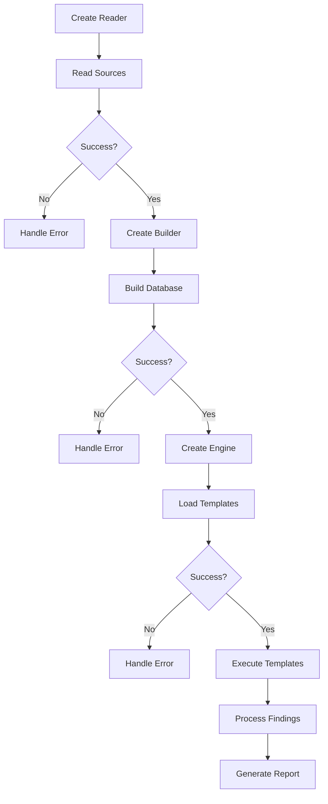

# W3GoAudit SDK Documentation

Complete SDK reference for integrating W3GoAudit into your Go applications.

---

## Table of Contents

- [Overview](#overview)
- [Installation](#installation)
- [Exposed Packages](#exposed-packages)
- [Quick Start](#quick-start)
- [Core Workflow](#core-workflow)
- [API Reference](#api-reference)
- [Edge Cases and Error Handling](#edge-cases-and-error-handling)
- [Advanced Usage](#advanced-usage)
- [Complete Examples](#complete-examples)
- [Best Practices](#best-practices)

---

## Overview

The W3GoAudit SDK provides programmatic access to the Solidity contract analysis engine. It consists of five main packages:

```
pkg/
├── reader/      # File discovery and loading
├── builder/     # Database construction
├── engine/      # Template execution
├── types/       # Core data structures
└── report/      # Report generation
```

---

## Installation

```bash
go get github.com/th13vn/w3goaudit
```

**Import packages:**

```go
import (
    "github.com/th13vn/w3goaudit/pkg/reader"
    "github.com/th13vn/w3goaudit/pkg/builder"
    "github.com/th13vn/w3goaudit/pkg/engine"
    "github.com/th13vn/w3goaudit/pkg/types"
    "github.com/th13vn/w3goaudit/pkg/report"
)
```

---

## Exposed Packages

### 1. pkg/reader

**Purpose:** Discover and load Solidity files.

**Exposed Types:**
- `Reader` - Main reader struct
- `SourceFile` - Parsed source file representation

**Exported Functions:**
```go
func New() *Reader
func (r *Reader) Read(path string) ([]*types.SourceFile, error)
func (r *Reader) ReadFile(path string) (*types.SourceFile, error)
func (r *Reader) ReadFiles(paths []string) ([]*types.SourceFile, error)
func (r *Reader) ReadDirectory(dirPath string) ([]*types.SourceFile, error)
func (r *Reader) GetAllSources() []*types.SourceFile
func (r *Reader) ResolveImports(projectRoot string) error
func DetectProjectRoot(path string) (string, error)
func DetectFramework(projectRoot string) string
func SetVerboseWriter(w io.Writer)  // Set custom verbose output writer
```

**What It Does:**
- Auto-detect file vs directory
- Recursively scan directories
- Skip build/test directories
- Detect project framework
- Load file contents

---

### 2. pkg/builder

**Purpose**: Parse AST and build contract database.

**Exposed Types:**
- `Builder` - Database builder

**Exported Functions:**
```go
func New() *Builder
func (b *Builder) Build(sources []*types.SourceFile) (*types.Database, error)
func (b *Builder) GetDatabase() *types.Database
func SetVerboseWriter(w io.Writer)  // Set custom verbose output writer
```

**What It Does:**
- Parse Solidity files (7-phase process)
- Build AST trees
- Calculate function selectors
- Resolve inheritance (C3 linearization)
- Build call graphs
- Identify entry points

---

### 3. pkg/engine

**Purpose:** Execute WQL templates to find vulnerabilities.

**Exposed Types:**
- `Engine` - Query execution engine
- `Template` - WQL template structure
- `TemplateLoadOptions` - Directory loading policy
- `Finding` - Vulnerability finding
- `Location` - Finding location
- `RelatedLocation` - Additional matched source site for multi-condition findings

**Exported Functions:**
```go
func New(db *types.Database) *Engine
func (e *Engine) Execute(tmpl *Template) []*Finding
func (e *Engine) ExecuteAll(templates []*Template) []*Finding
func LoadTemplate(path string) (*Template, error)
func LoadTemplates(dir string) ([]*Template, error)
func LoadTemplatesWithOptions(dir string, opts TemplateLoadOptions) ([]*Template, error)
func LoadTemplatesLenient(dir string) ([]*Template, error)
func LoadTemplatesFromFS(fsys fs.FS, dir string, opts TemplateLoadOptions) ([]*Template, error) // load from an embed.FS / any fs.FS
func ParseTemplate(yamlContent string) (*Template, error)  // load from an in-memory YAML string
func (e *Engine) SetLocationSource(src LocationSource)
func SetVerboseWriter(w io.Writer)  // Set custom verbose output writer
```

`LoadTemplatesFromFS` applies the same fail-closed validation as the
directory loader and backs the binary's embedded default pack
(`github.com/th13vn/w3goaudit/templates`.`Official`). `ParseTemplate` is the
inline equivalent of `LoadTemplate` for SDK consumers that hold YAML in memory.

> **WQL v2:** All 106 official/benchmark/feature-test templates shipped in
> this repo are written in **WQL v2** (`select`/`from`/`where` — see
> [`docs/wql-syntax.md`](./wql-syntax.md)) as of v0.4. `LoadTemplate` /
> `LoadTemplates` / `ParseTemplate` auto-detect v1 `query:` vs v2 per
> document — no version flag or opt-in needed. `templates/security/` still
> holds legacy v1 seed templates, which continue to load unchanged.

**What It Does:**
- Load YAML templates
- Parse WQL syntax
- Execute queries against database
- Generate findings with locations

---

### 4. pkg/types

**Purpose:** Core data structures.

**Exposed Types:**
```go
type SourceFile struct {
    Path          string
    Content       string
    Checksum      string // SHA256 hash
    Contracts     []string
    Imports       []string
    PragmaVersion string
}

type Database struct {
    ProjectRoot   string
    SourceFiles   map[string]*SourceFile
    Contracts     map[string]*Contract
    MainContracts map[string]*MainContractEntry
    CallGraph     *CallGraph
    DataFlow      *DataFlowGraph
    Semantics     *SemanticFacts
    Framework     string
}

type TypeInfo struct {
    Name       string // address, IERC20, mapping(address => uint256)
    BaseName   string
    Kind       string // primitive, contract, interface, library, abstract, struct, array, mapping, unknown
    ContractID string
    IsAddress  bool
    IsPayable  bool
    Confidence string // high, medium, low
    Source     string // parameter, state_var, local_var, type_cast, builtin, ...
}

type SemanticFacts struct {
    Symbols map[string]*SemanticSymbol
}

type MainContractEntry struct {
    EntryFunctions  []string  // resolved entry function IDs
    LinearizedBases []string  // C3 linearization (most derived first)
}

type Contract struct {
    ID                string
    Name              string
    Kind              ContractKind  // contract, interface, library, abstract
    SourceFile        string
    BaseContracts     []string
    LinearizedBases   []string  // C3 linearization (most derived first)
    InheritanceWeight int
    Functions         []*Function
    StateVariables    []*StateVariable
    Events            []*Event
    Modifiers         []*Modifier
    Structs           []*Struct
    Enums             []*Enum
    IsAbstract        bool
    StartLine, EndLine       int  // source location
    StartCol, EndCol         int  // 1-based columns (v0.4)
    StartByte, EndByte       int  // character offsets (v0.4)
}

type Function struct {
    Name            string
    ContractName    string
    Visibility      Visibility       // public, external, internal, private
    StateMutability StateMutability  // pure, view, payable, nonpayable
    Parameters      []*Parameter
    Returns         []*Parameter
    Modifiers       []string
    Selector        string  // canonical: name(type1,type2,...)
    Signature       string  // 4-byte hex keccak256 of selector
    AST             *ASTNode
    Calls           []*FunctionCall
    StartLine       int
    EndLine         int
    StartCol        int  // 1-based column of StartLine (v0.4)
    EndCol          int  // 1-based column of EndLine (v0.4)
    StartByte       int  // character offset into the source file (v0.4)
    EndByte         int  // character offset into the source file (v0.4)
}
```

> **v0.4 — precise source locations:** `StartCol`/`EndCol`/`StartByte`/
> `EndByte` are new on `Contract` and `Function` above, and on every other
> declaration type (`Modifier`, `StateVariable`, `Event`, `Struct`, `Enum`,
> `Parameter`) plus `ASTNode` itself — including interior statement/expression
> nodes, not just declaration roots. Columns are 1-based; byte offsets are
> character offsets into the source file; all four are zero for synthetic
> nodes with no source counterpart. `FunctionCall` and `CallEdge` (the
> call-graph edge type) gained a matching `Col`/`Byte` pair for the call site.
> Output `schemaVersion` bumped `1.0.0` → `2.0.0` for this change. See
> [`pkg/types/INDEX.md`](../pkg/types/INDEX.md) and
> [`pkg/builder/INDEX.md`](../pkg/builder/INDEX.md#locationgo) for the full
> field/helper reference.

**Exported Functions:**
```go
func NewDatabase() *Database
func (db *Database) GetContract(id string) *Contract
func (db *Database) GetContractByName(name string) *Contract
func (db *Database) GetAllFunctions() []*Function
func (db *Database) GetContractByID(id string) *Contract
func (db *Database) ResolveContractName(name, fromFile string) *Contract
func (db *Database) GetStats() *DatabaseStats
func LoadFromJSON(path string) (*Database, error)  // Load pre-built database from JSON
func MakeContractID(filePath, contractName string) string
func MakeFunctionID(filePath, contractName, funcName string) string
```

---

### 5. pkg/report

**Purpose:** Generate formatted reports.

**Exposed Types:**
- `Generator` - Report generator
- `SummaryReport` - Project summary
- `BundleOptions` - Result-folder options (`HTML bool`)
- `ToolMeta` - Tool name/version metadata stamped into reports
- `NavJSON` / `ExplorerJSON` - extension data-layer models (v0.4, see below)

**Exported Functions:**
```go
func NewGenerator(db *types.Database) *Generator
func (g *Generator) GenerateSummary() *SummaryReport
func FormatFindingsAsMarkdown(findings []*engine.Finding, db *types.Database) string
func FormatFindingsAsHTML(findings []*engine.Finding, db *types.Database) string
func FormatFindingsAsSARIF(findings []*engine.Finding, tool ToolMeta, projectRoot string) (string, error)

// WriteBundle renders the complete scan result folder (overview.md, findings.md,
// results.sarif, data/{database,findings,overview,nav,explorer}.json, and one
// folder per main contract with state-changes.md + workflows/<entryFn>.md).
// run.log is written separately by the CLI; HTML mirrors are added when
// opts.HTML is set.
func WriteBundle(dir string, db *types.Database, summary *SummaryReport,
    findings []*engine.Finding, tool ToolMeta, opts BundleOptions) error

// BuildNavJSON/BuildExplorerJSON produce the two extension data-layer models
// (see below); WriteBundle calls both internally to emit data/nav.json and
// data/explorer.json.
func BuildNavJSON(db *types.Database) *NavJSON
func BuildExplorerJSON(db *types.Database) *ExplorerJSON

// Severity helpers — the single source of truth shared by the formatters and
// the CLI's --severity / --min-severity filters.
var SeverityOrder []string                       // CRITICAL > HIGH > MEDIUM > LOW > INFO
func SeverityRank(severity string) int           // lower = more severe; unknown ranks last
func SeverityAtLeast(severity, threshold string) bool
func IsKnownSeverity(s string) bool
```

**What It Does:**
- Format findings as Markdown/HTML/SARIF/JSON
- Generate project summaries
- Write the complete scan result folder (`WriteBundle`)
- Build the extension data layer (`BuildNavJSON`/`BuildExplorerJSON`)
- Create call graph visualizations
- Extract code snippets

> **v0.4 — extension data layer:** `BuildNavJSON` and `BuildExplorerJSON`
> (`pkg/report/nav.go`, `pkg/report/explorer.go`) build the two JSON models
> the VSCode extension consumes (`data/nav.json` / `data/explorer.json`;
> `WriteBundle` calls both automatically). Both share `SrcRange`, a compact
> 1-based line/column span with character byte offsets and omitted zero
> fields:
>
> ```go
> type SrcRange struct {
>     File                                  string
>     StartLine, StartCol, EndLine, EndCol  int
>     StartByte, EndByte                    int
> }
>
> // NavJSON is the semantic navigation index: definitions, reverse call
> // edges, and interface -> implementation mappings.
> type NavJSON struct {
>     SchemaVersion string
>     Symbols       []*NavSymbol        // contract/function/stateVar declarations
>     Callers       []*NavCaller        // reverse call edges: callee <- caller @ site
>     InterfaceImpl []*NavInterfaceImpl // interface method -> most-derived override
> }
> type NavSymbol struct {
>     ID, Kind, Name, Selector string // Kind: "contract" | "function" | "stateVar"
>     Range                    SrcRange
> }
> type NavCaller struct {
>     Callee, Caller string // function IDs
>     Site           SrcRange
> }
> type NavInterfaceImpl struct { Interface, Method, Implementation string }
>
> // ExplorerJSON is the explorer-tab model: one entry per deployable (main)
> // contract, with constants/storage/entry-functions/getters resolved
> // through the C3-linearized inheritance chain.
> type ExplorerJSON struct {
>     SchemaVersion string
>     Contracts     []*ExplorerContract
> }
> type ExplorerContract struct {
>     ID, Name, Kind string
>     Range          SrcRange
>     Constants      []*ExplorerStateVar // constant + immutable
>     Storage        []*ExplorerStateVar // mutable storage, slot order (base-first MRO)
>     EntryFunctions []*ExplorerFunc     // state-mutating public/external
>     Getters        []*ExplorerFunc     // public/external view/pure
> }
> type ExplorerStateVar struct {
>     Name, TypeName, Visibility string
>     Constant, Immutable        bool
>     Range                      SrcRange
> }
> type ExplorerFunc struct {
>     Name, Selector, Signature, Visibility, Mutability string
>     Modifiers                                         []string
>     Range                                              SrcRange
> }
> ```
>
> See [`docs/extension-output.md`](./extension-output.md) for the full
> `nav.json` / `explorer.json` schema and worked examples.

---

## Quick Start

### Minimal Example

```go
package main

import (
    "fmt"
    "log"
    
    "github.com/th13vn/w3goaudit/pkg/builder"
    "github.com/th13vn/w3goaudit/pkg/engine"
    "github.com/th13vn/w3goaudit/pkg/reader"
)

func main() {
    // 1. Read source files
    r := reader.New()
    sources, err := r.Read("./contracts/")
    if err != nil {
        log.Fatal(err)
    }
    
    // 2. Build database
    b := builder.New()
    db, err := b.Build(sources)
    if err != nil {
        log.Fatal(err)
    }
    
    // 3. Load template
    e := engine.New(db)
    tmpl, err := engine.LoadTemplate("./template.yaml")
    if err != nil {
        log.Fatal(err)
    }
    
    // 4. Execute and print findings
    findings := e.Execute(tmpl)
    fmt.Printf("Found %d issues\n", len(findings))
    for _, f := range findings {
        fmt.Printf("[%s] %s at %s:%d\n", 
            f.Severity, f.Title, f.Location.File, f.Location.Line)
    }
}
```

---

## Core Workflow

### Correct Usage Flow



### Step-by-Step Correct Flow

**Step 1: Initialize Reader**
```go
r := reader.New()
```

**Step 2: Read Source Files**
```go
// Option A: Auto-detect (file or directory)
sources, err := r.Read("./path/to/contracts/")
if err != nil {
    return fmt.Errorf("read failed: %w", err)
}

// Option B: Read specific file
source, err := r.ReadFile("./MyContract.sol")
sources = []*types.SourceFile{source}

// Option C: Read multiple files
sources, err := r.ReadFiles([]string{"A.sol", "B.sol"})
```

**Step 3: Build Database**
```go
b := builder.New()
db, err := b.Build(sources)
if err != nil {
    return fmt.Errorf("build failed: %w", err)
}
```

**Step 4: Create Engine**
```go
e := engine.New(db)
```

**Step 5: Load Templates**
```go
// Single template
tmpl, err := engine.LoadTemplate("./reentrancy.yaml")

// Multiple templates from directory
templates, err := engine.LoadTemplates("./templates/official/")
```

**Step 6: Execute**
```go
// Execute single template
findings := e.Execute(tmpl)

// Execute all templates
allFindings := e.ExecuteAll(templates)
```

**Step 7: Process Results**
```go
for _, finding := range findings {
    fmt.Printf("Severity: %s\n", finding.Severity)
    fmt.Printf("Title: %s\n", finding.Title)
    fmt.Printf("File: %s\n", finding.Location.File)
    fmt.Printf("Line: %d\n", finding.Location.Line)
}
```

---

## API Reference

### reader.Reader

#### Constructor

```go
func New() *Reader
```

Creates a new Reader instance.

**Returns:** `*Reader`

**Example:**
```go
r := reader.New()
```

---

#### Read

```go
func (r *Reader) Read(path string) ([]*types.SourceFile, error)
```

Auto-detects whether path is a file or directory and reads accordingly.

**Parameters:**
- `path` (string) - File or directory path (absolute or relative)

**Returns:**
- `[]*types.SourceFile` - List of source files
- `error` - Error if any

**Errors:**
- Path doesn't exist
- Permission denied
- Not a .sol file (for files)

**Example:**
```go
sources, err := r.Read("./contracts/")
if err != nil {
    log.Fatal(err)
}
```

---

#### ReadFile

```go
func (r *Reader) ReadFile(path string) (*types.SourceFile, error)
```

Reads a single Solidity file.

**Parameters:**
- `path` (string) - File path

**Returns:**
- `*types.SourceFile` - Source file
- `error` - Error if any

**Errors:**
- Not a .sol file
- File doesn't exist
- Permission denied

**Example:**
```go
source, err := r.ReadFile("./MyToken.sol")
```

---

#### ReadDirectory

```go
func (r *Reader) ReadDirectory(dirPath string) ([]*types.SourceFile, error)
```

Recursively reads all .sol files in a directory.

**Parameters:**
- `dirPath` (string) - Directory path

**Returns:**
- `[]*types.SourceFile` - List of source files
- `error` - Error if any

**Auto-excluded directories:**
- `node_modules`, `out`, `artifacts`, `cache`, `test`, `lib`, etc.

**Example:**
```go
sources, err := r.ReadDirectory("./src/")
```

---

### builder.Builder

#### Constructor

```go
func New() *Builder
```

Creates a new Builder instance.

**Example:**
```go
b := builder.New()
```

---

#### Build

```go
func (b *Builder) Build(sources []*types.SourceFile) (*types.Database, error)
```

Builds a complete database from source files through 7 phases.

**Parameters:**
- `sources` ([]*types.SourceFile) - Source files from reader

**Returns:**
- `*types.Database` - Complete database
- `error` - Error if build fails

**Build Phases:**
1. Parse files
2. Build ASTs, intra-procedural data flow, and semantic type facts
3. Calculate selectors
4. Build inheritance
5. Build call graph
6. Calculate entry points
7. Analyze per-function effects (state writes, guards, access control)

**Errors:**
- Parse errors (syntax errors in Solidity)
- AST building errors
- Inheritance resolution errors

**Example:**
```go
db, err := b.Build(sources)
if err != nil {
    log.Fatalf("Build failed: %v", err)
}
```

---

### engine.Engine

#### Constructor

```go
func New(db *types.Database) *Engine
```

Creates a new Engine with a database.

**Parameters:**
- `db` (*types.Database) - Database from builder

**Returns:** `*Engine`

**Example:**
```go
e := engine.New(db)
```

---

#### Execute

```go
func (e *Engine) Execute(tmpl *Template) []*Finding
```

Executes a single template against the database.

**Parameters:**
- `tmpl` (*Template) - Template to execute

**Returns:**
- `[]*Finding` - List of findings (empty if none found)

**Example:**
```go
findings := e.Execute(tmpl)
```

---

#### ExecuteAll

```go
func (e *Engine) ExecuteAll(templates []*Template) []*Finding
```

Executes multiple templates.

**Parameters:**
- `templates` ([]*Template) - Templates to execute

**Returns:**
- `[]*Finding` - Combined findings from all templates

**Example:**
```go
allFindings := e.ExecuteAll(templates)
```

---

#### LoadTemplate

```go
func LoadTemplate(path string) (*Template, error)
```

Loads a single YAML template.

**Parameters:**
- `path` (string) - Template file path

**Returns:**
- `*Template` - Loaded template
- `error` - Error if parsing fails

**Errors:**
- File doesn't exist
- Invalid YAML syntax
- Missing required fields

**Example:**
```go
tmpl, err := engine.LoadTemplate("./reentrancy.yaml")
if err != nil {
    log.Fatal(err)
}
```

---

#### LoadTemplates

```go
func LoadTemplates(dir string) ([]*Template, error)
```

Loads all .yaml/.yml templates from a directory.

`LoadTemplates` is fail-closed: malformed YAML, failed validation, missing
`meta.id`, missing `meta.severity`, or zero valid templates returns an error.
This is the recommended behavior for production/CI scans.

**Parameters:**
- `dir` (string) - Directory path

**Returns:**
- `[]*Template` - List of loaded templates
- `error` - Error if any template fails or no valid templates are found

**Example:**
```go
templates, err := engine.LoadTemplates("./templates/official/")
```

---

#### LoadTemplatesWithOptions / LoadTemplatesLenient

```go
type TemplateLoadOptions struct {
    IgnoreInvalid bool
}

func LoadTemplatesWithOptions(dir string, opts TemplateLoadOptions) ([]*Template, error)
func LoadTemplatesLenient(dir string) ([]*Template, error)
```

Use these only for mixed or ad-hoc directories where invalid templates should
be skipped intentionally. Even lenient loading returns an error when no valid
templates are found.

**Example:**
```go
templates, err := engine.LoadTemplatesWithOptions(
    "./scratch-rules/",
    engine.TemplateLoadOptions{IgnoreInvalid: true},
)
```

---

#### SetLocationSource

```go
func (e *Engine) SetLocationSource(src LocationSource)
```

Selects how `Finding.Location` is computed.

| Value | Behavior |
|---|---|
| `LocationSourceVerifier` *(default)* | `Function`/`Contract` come from the verifier-function context (today's behavior). `Line` from the matched node when available. Backward-compatible. |
| `LocationSourceMatchedNode` | Every field of `Location` is derived from the matched AST node's enclosing function/modifier — the dangerous statement. Aligns w3goaudit with SARIF / Slither / Semgrep conventions. |

The env var `WGAUDIT_LOCATION_FROM_MATCHED_NODE` (`1`/`true`/`matched`)
takes precedence over the API call so CI/scripts can flip the mode without
touching code. The new structured fields on `Finding` (`Reachability`,
`PrimaryAST`, `EntryPoint`, `Related`) are populated **regardless** of this setting —
only `Location` itself changes.

**Example:**
```go
e := engine.New(db)
e.SetLocationSource(engine.LocationSourceMatchedNode)
findings := e.ExecuteAll(templates)
// findings[i].Location.Function now names the host of the dangerous
// statement; findings[i].EntryPoint names the auditor-actionable fix site.
```

---

#### Finding (extended shape)

`Finding` carries optional structured fields populated whenever the engine can
determine them. They sit alongside the existing
`TemplateID`/`Severity`/`Title`/`Location`/etc.:

```go
type Finding struct {
    // ...existing fields...

    Related      []RelatedLocation  // additional sites contributing to this finding
    Reachability *ReachabilityPath // call chain entry -> ... -> host
    PrimaryAST   *NodeRef          // kind / name / line of the matched AST node
    EntryPoint   *EntryRef         // auditor-actionable fix-here function
}

type RelatedLocation struct {
    Label    string // from the matched `where`-level `all:` branch's `label:` field; falls back to "condition N"
    File     string
    Contract string
    Function string
    Line     int
    Kind     string // matched AST kind
    Name     string // matched AST name
}

type ReachabilityPath struct { Steps []ReachStep }

type ReachStep struct {
    Contract   string
    Function   string
    Visibility string // public/external/internal/private
    Line       int
    // AuthVerdict and AuthReasons are populated once the semantic
    // access-control analyzer ships (see .vscode/2026-05-28-…).
    AuthVerdict string
    AuthReasons []string
}

type NodeRef struct {
    Kind  string
    Name  string
    Start int
    End   int
}

type EntryRef struct {
    Contract    string
    Function    string
    AuthVerdict string
    AuthReasons []string
}
```

Reading these from SDK code:

```go
for _, f := range findings {
    for _, rel := range f.Related {
        fmt.Printf("  related: %s %s.%s() L%d\n",
            rel.Label, rel.Contract, rel.Function, rel.Line)
    }
    if f.Reachability == nil { continue }
    for i, step := range f.Reachability.Steps {
        fmt.Printf("  step[%d]: %s.%s() L%d (%s)\n",
            i, step.Contract, step.Function, step.Line, step.Visibility)
    }
    if f.EntryPoint != nil {
        fmt.Printf("  fix-here: %s.%s\n", f.EntryPoint.Contract, f.EntryPoint.Function)
    }
}
```

---

### types.Database

#### GetStats

```go
func (db *Database) GetStats() *DatabaseStats
```

Returns database statistics.

**Returns:**
```go
type DatabaseStats struct {
    TotalFiles          int
    TotalContracts      int
    TotalInterfaces     int
    TotalLibraries      int
    TotalFunctions      int
    TotalEntryFunctions int
    MainContractsCount  int
}
```

**Example:**
```go
stats := db.GetStats()
fmt.Printf("Contracts: %d\n", stats.TotalContracts)
```

---

#### GetContract

```go
func (db *Database) GetContract(id string) *Contract
```

Gets a contract by ID.

**Parameters:**
- `id` (string) - Contract ID (format: `absPath#ContractName`)

**Returns:** `*Contract` (nil if not found)

**Example:**
```go
contract := db.GetContract("/path/to/file.sol#MyToken")
```

---

#### GetContractByName

```go
func (db *Database) GetContractByName(name string) *Contract
```

Gets the contract matching the name. On a name collision (the same name in more
than one file) it returns the candidate with the lexicographically-smallest ID,
so the result is deterministic across runs. Prefer `GetContractByID` when you
already hold a fully-qualified `absPath#Name` ID, or `ResolveContractName` when
you have a referring file and want scope-aware disambiguation.

**Parameters:**
- `name` (string) - Contract name

**Returns:** `*Contract` (nil if not found)

**Example:**
```go
contract := db.GetContractByName("MyToken")
```

---

#### ResolveContractName

```go
func (db *Database) ResolveContractName(name, fromFile string) *Contract
```

Resolves an unqualified contract name to a concrete contract, preferring the
candidate "closest" to `fromFile` when the name is ambiguous: same file → same
directory → a relative import in `fromFile` that resolves exactly → else the
lexicographically-smallest ID. Used internally by C3 linearization and
internal-call resolution so a project's real `Token` is not confused with a
`test/mocks/Token`. It is a deterministic heuristic, not full import-scope
resolution (remapped imports like `@openzeppelin/...` are not resolved).

**Parameters:**
- `name` (string) - Unqualified contract name
- `fromFile` (string) - Absolute source path of the referring contract (pass
  `""` to fall back to plain lex-min behaviour)

**Returns:** `*Contract` (nil if no contract has that name)

**Example:**
```go
base := db.ResolveContractName("IERC20", derived.SourceFile)
```

---

### report.Generator

#### NewGenerator

```go
func NewGenerator(db *types.Database) *Generator
```

Creates a report generator.

**Example:**
```go
gen := report.NewGenerator(db)
```

---

#### GenerateSummary

```go
func (g *Generator) GenerateSummary() *SummaryReport
```

Generates a comprehensive project summary.

**Returns:** `*SummaryReport` with:
- Statistics
- Contract summaries
- Inheritance trees
- Call graphs

**Example:**
```go
summary := gen.GenerateSummary()
markdown := summary.ToMarkdown()
html := summary.ToHTML()
```

---

## Edge Cases and Error Handling

### Common Edge Cases

#### 1. Empty Source Files

**Problem:**
```go
sources, _ := r.Read("./empty-dir/")
db, err := b.Build(sources)  // What happens?
```

**Behavior:**
- Builder succeeds with empty database
- No contracts, functions, or findings

**Correct Handling:**
```go
sources, err := r.Read(path)
if err != nil {
    return err
}

if len(sources) == 0 {
    return fmt.Errorf("no Solidity files found in %s", path)
}

db, err := b.Build(sources)
```

---

#### 2. Nil Database to Engine

**Problem:**
```go
var db *types.Database = nil
e := engine.New(db)  // CRASH on Execute!
```

**Error:** Panic when executing templates

**Correct Handling:**
```go
db, err := b.Build(sources)
if err != nil {
    return err
}
if db == nil {
    return errors.New("database is nil")
}

e := engine.New(db)
```

---

#### 3. Invalid Template Path

**Problem:**
```go
tmpl, err := engine.LoadTemplate("./nonexistent.yaml")
// err is not nil, but code doesn't check
findings := e.Execute(tmpl)  // CRASH! tmpl is nil
```

**Correct Handling:**
```go
tmpl, err := engine.LoadTemplate("./template.yaml")
if err != nil {
    return fmt.Errorf("failed to load template: %w", err)
}

findings := e.Execute(tmpl)
```

---

#### 4. Building Without Sources

**Problem:**
```go
b := builder.New()
db, err := b.Build(nil)  // What happens?
```

**Behavior:**
- Builder succeeds with empty database
- No errors, but database is useless

**Correct Handling:**
```go
if sources == nil || len(sources) == 0 {
    return fmt.Errorf("no sources to build")
}

db, err := b.Build(sources)
```

---

#### 5. Parse Errors in Solidity

**Problem:**
```go
sources := []*types.SourceFile{
    {Path: "bad.sol", Content: "contract { invalid syntax }"},
}
db, err := b.Build(sources)  // What happens?
```

**Behavior:**
- Builder returns error with parse details
- Database is nil

**Correct Handling:**
```go
db, err := b.Build(sources)
if err != nil {
    // Log or report which file failed
    log.Printf("Build failed: %v", err)
    return err
}
```

---

#### 6. Reading Non-Solidity Files

**Problem:**
```go
source, err := r.ReadFile("./README.md")
```

**Error:** `not a Solidity file: README.md`

**Correct Handling:**
```go
if !strings.HasSuffix(path, ".sol") {
    return fmt.Errorf("%s is not a Solidity file", path)
}
source, err := r.ReadFile(path)
```

---

#### 7. Concurrent Access to Database

**Problem:**
```go
// Goroutine 1
db, _ := b.Build(sources)

// Goroutine 2
stats := db.GetStats()  // Race condition!
```

**Issue:** Database is not thread-safe

**Correct Handling:**
```go
var mu sync.RWMutex

// Writer
mu.Lock()
db, _ := b.Build(sources)
mu.Unlock()

// Reader
mu.RLock()
stats := db.GetStats()
mu.RUnlock()
```

---

#### 8. Template Validation Errors

**Problem:**
```yaml
# Invalid v2 template - missing required metadata
select: external_call
from: entry_function
where:
  - preset: user_controlled
# Missing 'meta.severity'!
```

**Error on Load:**
```
template <path>: missing meta.severity
```

**Correct Handling:**
```go
tmpl, err := engine.LoadTemplate(path)
if err != nil {
    if strings.Contains(err.Error(), "validation") {
        return fmt.Errorf("template is invalid: %w", err)
    }
    return err
}
```

---

#### 9. No Findings vs Error

**Problem:**
```go
findings := e.Execute(tmpl)
if len(findings) == 0 {
    // Is this an error or just safe code?
}
```

**Clarification:**
- Empty findings = no vulnerabilities found (success!)
- Engine doesn't return errors; check results

**Correct Handling:**
```go
findings := e.Execute(tmpl)
if len(findings) == 0 {
    log.Println("No issues found - code is clean!")
} else {
    log.Printf("Found %d issues", len(findings))
}
```

---

#### 10. Large Projects - Memory Issues

**Problem:**
```go
// Scanning 1000+ files
sources, _ := r.Read("./huge-project/")
db, _ := b.Build(sources)  // Out of memory!
```

**Mitigation:**
```go
// Process in batches
batches := splitIntoBatches(sources, 100)
for _, batch := range batches {
    db, err := b.Build(batch)
    // Process each batch
}
```

---

## Advanced Usage

### Custom Analysis Pipeline

```go
package main

import (
    "encoding/json"
    "fmt"
    "os"
    
    "github.com/th13vn/w3goaudit/pkg/builder"
    "github.com/th13vn/w3goaudit/pkg/engine"
    "github.com/th13vn/w3goaudit/pkg/reader"
    "github.com/th13vn/w3goaudit/pkg/types"
)

func main() {
    // Custom pipeline with caching
    db, err := getOrBuildDatabase("./contracts/", "./cache/db.json")
    if err != nil {
        panic(err)
    }
    
    // Run the official template pack
    official := runTemplates(db, "./templates/official/")
    
    // Custom filtering
    filtered := filterFindings(official, func(f *engine.Finding) bool {
        return f.Confidence == "HIGH"
    })
    
    // Custom report
    generateCustomReport(filtered, "./report.md")
}

func getOrBuildDatabase(srcPath, cachePath string) (*types.Database, error) {
    // Try loading from cache using LoadFromJSON
    db, err := types.LoadFromJSON(cachePath)
    if err == nil {
        fmt.Println("Loaded database from cache:", cachePath)
        return db, nil
    }
    
    // Build fresh if cache doesn't exist
    fmt.Println("Building fresh database...")
    r := reader.New()
    sources, err := r.Read(srcPath)
    if err != nil {
        return nil, err
    }
    
    b := builder.New()
    db, err = b.Build(sources)
    if err != nil {
        return nil, err
    }
    
    // Cache for next time
    data, err := json.MarshalIndent(db, "", "  ")
    if err != nil {
        return nil, err
    }
    if err := os.WriteFile(cachePath, data, 0644); err != nil {
        return nil, err
    }
    fmt.Println("Cached database to:", cachePath)
    
    return db, nil
}

func runTemplates(db *types.Database, dir string) []*engine.Finding {
    e := engine.New(db)
    templates, err := engine.LoadTemplates(dir)
    if err != nil {
        return nil
    }
    return e.ExecuteAll(templates)
}

func filterFindings(findings []*engine.Finding, 
    predicate func(*engine.Finding) bool) []*engine.Finding {
    var result []*engine.Finding
    for _, f := range findings {
        if predicate(f) {
            result = append(result, f)
        }
    }
    return result
}
```

---

### Database Inspection

```go
func inspectDatabase(db *types.Database) {
    stats := db.GetStats()
    
    fmt.Printf("=== Database Statistics ===\n")
    fmt.Printf("Files: %d\n", stats.TotalFiles)
    fmt.Printf("Contracts: %d\n", stats.TotalContracts)
    fmt.Printf("Functions: %d\n", stats.TotalFunctions)
    
    // Inspect main contracts
    fmt.Printf("\n=== Main Contracts ===\n")
    for contractID, entry := range db.MainContracts {
        _, name := types.ParseContractID(contractID)
        fmt.Printf("%s: %d entry points, linearized: %v\n", name, len(entry.EntryFunctions), entry.LinearizedBases)
    }
    
    // Inspect specific contract
    contract := db.GetContractByName("MyToken")
    if contract != nil {
        fmt.Printf("\n=== MyToken Details ===\n")
        fmt.Printf("Kind: %s\n", contract.Kind)
        fmt.Printf("Functions: %d\n", len(contract.Functions))
        fmt.Printf("Inherits: %v\n", contract.LinearizedBases)
        
        for _, fn := range contract.Functions {
            fmt.Printf("  - %s() visibility:%s\n", fn.Name, fn.Visibility)
        }
    }
}
```

---

### Verbose Logging Configuration

Control verbose output across all packages with custom writers.

**Enable Verbose Logging to File:**

```go
package main

import (
    \"os\"
    
    \"github.com/th13vn/w3goaudit/pkg/builder\"
    \"github.com/th13vn/w3goaudit/pkg/engine\"
    \"github.com/th13vn/w3goaudit/pkg/reader\"
)

func main() {
    // Create verbose log file
    logFile, err := os.Create(\"verbose.log\")
    if err != nil {
        panic(err)
    }
    defer logFile.Close()
    
    // Enable verbose logging to file for all packages
    reader.VerboseEnabled = true
    reader.SetVerboseWriter(logFile)
    
    builder.VerboseEnabled = true
    builder.SetVerboseWriter(logFile)
    
    engine.VerboseEnabled = true
    engine.SetVerboseWriter(logFile)
    
    // Now all verbose output goes to verbose.log instead of stdout
    r := reader.New()
    sources, _ := r.Read(\"./contracts/\")
    
    b := builder.New()
    db, _ := b.Build(sources)
    
    // Verbose messages are in verbose.log
}
```

**Enable Verbose to Stdout (Default):**

```go
import \"os\"

// Simple toggle
reader.VerboseEnabled = true
builder.VerboseEnabled = true
engine.VerboseEnabled = true

// Explicitly set stdout (optional, this is the default)
reader.SetVerboseWriter(os.Stdout)
builder.SetVerboseWriter(os.Stdout)
engine.SetVerboseWriter(os.Stdout)
```

**Conditional Verbose Logging:**

```go
func buildWithVerbose(sources []*types.SourceFile, logPath string) (*types.Database, error) {
    // Setup verbose logging if path provided
    if logPath != \"\" {
        logFile, err := os.Create(logPath)
        if err != nil {
            return nil, fmt.Errorf(\"failed to create verbose log file: %w\", err)
        }
        defer logFile.Close()
        
        builder.VerboseEnabled = true
        builder.SetVerboseWriter(logFile)
    }
    
    b := builder.New()
    return b.Build(sources)
}

// Usage
db, err := buildWithVerbose(sources, \"build-verbose.log\")  // Verbose to file
db, err := buildWithVerbose(sources, \"\")                   // No verbose output
```

---

## Complete Examples

### Example 1: CI/CD Integration

```go
package main

import (
    "encoding/json"
    "fmt"
    "os"
    
    "github.com/th13vn/w3goaudit/pkg/builder"
    "github.com/th13vn/w3goaudit/pkg/engine"
    "github.com/th13vn/w3goaudit/pkg/reader"
)

func main() {
    exitCode := runSecurityScan()
    os.Exit(exitCode)
}

func runSecurityScan() int {
    // Read contracts
    r := reader.New()
    sources, err := r.Read("./contracts/")
    if err != nil {
        fmt.Fprintf(os.Stderr, "Error reading files: %v\n", err)
        return 1
    }
    
    if len(sources) == 0 {
        fmt.Println("No Solidity files found")
        return 0
    }
    
    // Build database
    b := builder.New()
    db, err := b.Build(sources)
    if err != nil {
        fmt.Fprintf(os.Stderr, "Error building database: %v\n", err)
        return 1
    }
    
    // Load templates
    e := engine.New(db)
    templates, err := engine.LoadTemplates("./templates/official/")
    if err != nil {
        fmt.Fprintf(os.Stderr, "Error loading templates: %v\n", err)
        return 1
    }
    
    // Execute
    findings := e.ExecuteAll(templates)
    
    // Save report
    data, err := json.MarshalIndent(findings, "", "  ")
    if err != nil {
        fmt.Fprintf(os.Stderr, "Error formatting report: %v\n", err)
        return 1
    }
    if err := os.WriteFile("security-report.json", data, 0644); err != nil {
        fmt.Fprintf(os.Stderr, "Error writing report: %v\n", err)
        return 1
    }
    
    // Count by severity
    critical := 0
    high := 0
    for _, f := range findings {
        switch f.Severity {
        case "CRITICAL":
            critical++
        case "HIGH":
            high++
        }
    }
    
    fmt.Printf("Security Scan Complete\n")
    fmt.Printf("Critical: %d\n", critical)
    fmt.Printf("High: %d\n", high)
    fmt.Printf("Total: %d\n", len(findings))
    
    // Fail if critical or high severity found
    if critical > 0 || high > 0 {
        return 1
    }
    
    return 0
}
```

---

### Example 2: Custom Reporting

```go
package main

import (
    "fmt"
    "log"
    "os"
    "sort"
    "strings"
    
    "github.com/th13vn/w3goaudit/pkg/builder"
    "github.com/th13vn/w3goaudit/pkg/engine"
    "github.com/th13vn/w3goaudit/pkg/reader"
)

func main() {
    // Setup
    r := reader.New()
    sources, _ := r.Read("./contracts/")
    
    b := builder.New()
    db, _ := b.Build(sources)
    
    e := engine.New(db)
    templates, err := engine.LoadTemplates("./templates/official/")
    if err != nil {
        log.Fatal(err)
    }
    findings := e.ExecuteAll(templates)
    
    // Generate custom Markdown report
    report := generateMarkdownReport(findings)
    if err := os.WriteFile("custom-report.md", []byte(report), 0644); err != nil {
        log.Fatal(err)
    }
}

func generateMarkdownReport(findings []*engine.Finding) string {
    var sb strings.Builder
    
    sb.WriteString("# Security Audit Report\n\n")
    sb.WriteString(fmt.Sprintf("Total Findings: %d\n\n", len(findings)))
    
    // Group by severity
    bySeverity := make(map[string][]*engine.Finding)
    for _, f := range findings {
        bySeverity[f.Severity] = append(bySeverity[f.Severity], f)
    }
    
    // Process each severity level
    severities := []string{"CRITICAL", "HIGH", "MEDIUM", "LOW", "INFO"}
    for _, sev := range severities {
        findings := bySeverity[sev]
        if len(findings) == 0 {
            continue
        }
        
        sb.WriteString(fmt.Sprintf("## %s (%d)\n\n", sev, len(findings)))
        
        for i, f := range findings {
            sb.WriteString(fmt.Sprintf("### %d. %s\n\n", i+1, f.Title))
            sb.WriteString(fmt.Sprintf("**Location:** `%s:%d`\n\n", 
                f.Location.File, f.Location.Line))
            sb.WriteString(fmt.Sprintf("**Description:** %s\n\n", f.Message))
            sb.WriteString("---\n\n")
        }
    }
    
    return sb.String()
}
```

---

## Best Practices

### 1. Always Check Errors

```go
// BAD:
sources, _ := r.Read(path)
db, _ := b.Build(sources)

// GOOD:
sources, err := r.Read(path)
if err != nil {
    return fmt.Errorf("read failed: %w", err)
}

db, err := b.Build(sources)
if err != nil {
    return fmt.Errorf("build failed: %w", err)
}
```

---

### 2. Validate Input

```go
// GOOD:
func Analyze(path string) error {
    if path == "" {
        return errors.New("path cannot be empty")
    }
    
    if _, err := os.Stat(path); os.IsNotExist(err) {
        return fmt.Errorf("path does not exist: %s", path)
    }
    
    // Proceed with analysis
    return nil
}
```

---

### 3. Cache Databases for Large Projects

```go
// GOOD: for repeated analysis
func getCachedDB(srcPath string) (*types.Database, error) {
    cacheFile := ".w3goaudit-cache.json"
    
    // Check if cache exists and is newer than sources
    if isValid, _ := isCacheValid(cacheFile, srcPath); isValid {
        return loadFromCache(cacheFile)
    }
    
    // Build fresh and cache
    db, err := buildDatabase(srcPath)
    if err == nil {
        saveToCache(db, cacheFile)
    }
    return db, err
}
```

---

### 4. Use Appropriate Template Scopes

```go
// GOOD: - Use entrypoint for security
tmpl := &engine.Template{
    Query: engine.Query{
        Scope: "entrypoint",  // Focus on attack surface
        Match: ...,
    },
}
```

---

### 5. Handle Template Load Failures Fail-Closed

```go
// GOOD:
templates, err := engine.LoadTemplates(dir)
if err != nil {
    return fmt.Errorf("template load failed: %w", err)
}
```

Use `LoadTemplatesWithOptions(dir, engine.TemplateLoadOptions{IgnoreInvalid: true})`
only for scratch rule folders where skipping invalid files is intentional.

---

### 6. Resource Cleanup

```go
// GOOD:
func analyzeProject(path string) error {
    r := reader.New()
    defer func() {
        // Clear loaded sources to free memory
        r.SourceFiles = nil
    }()
    
    sources, err := r.Read(path)
    if err != nil {
        return err
    }
    
    // ... rest of analysis
    return nil
}
```

---

## Related Documentation

- [Usage Guide](./usage.md) - CLI usage examples
- [Workflows](./workflows.md) - Internal workflow details
- [WQL Syntax](./wql-syntax.md) - Template writing guide
- [Project Overview](./project-overview.md) - Architecture details
