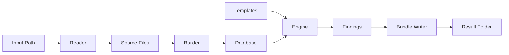
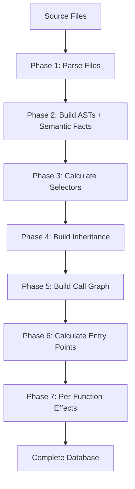
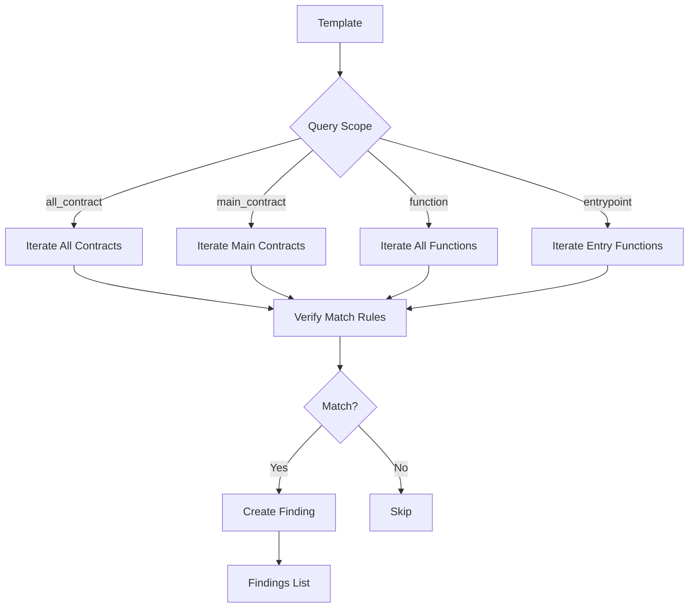
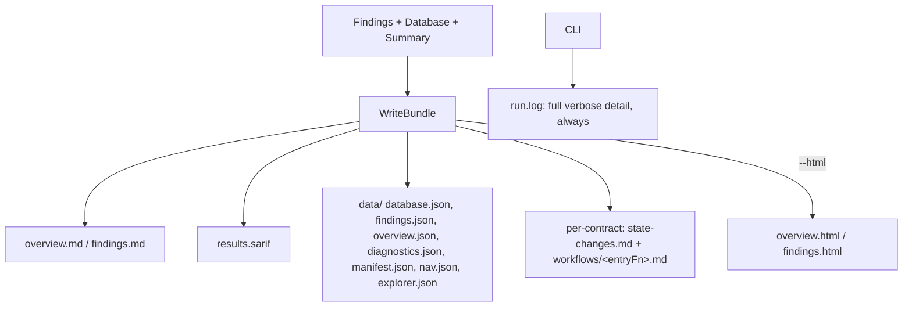
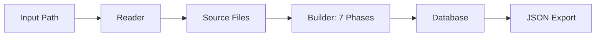
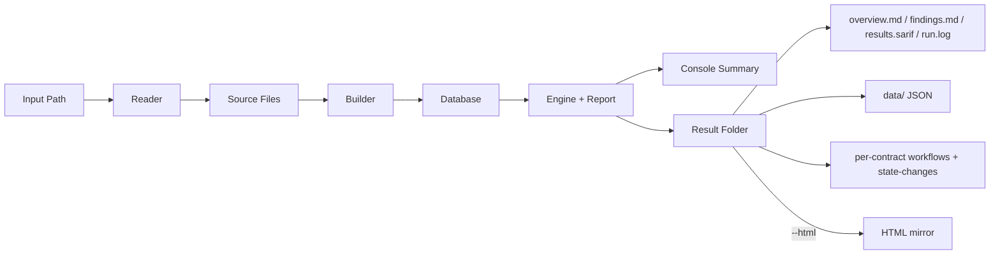
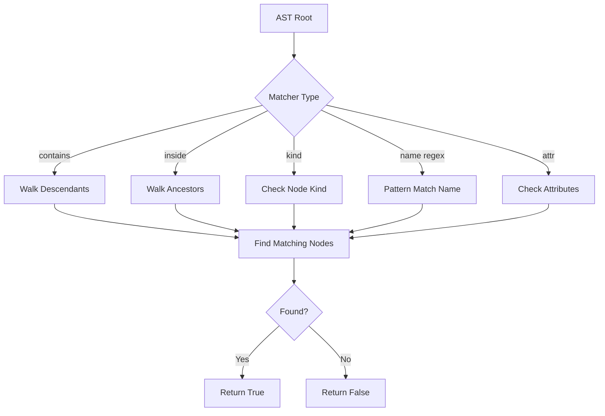
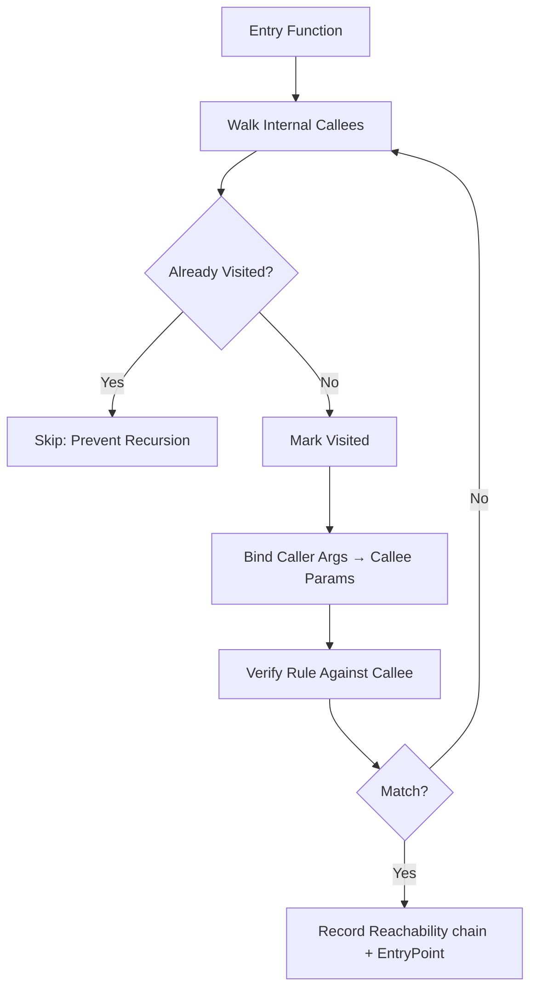

# W3GoAudit Workflows

This document explains the internal workflows of W3GoAudit, detailing how the engine processes Solidity contracts for security analysis.

## Overview

W3GoAudit has three product workflows plus one release-quality workflow:

1. **Scan Workflow** - Analyze contracts with security templates
2. **Build Workflow** - Construct contract database
3. **Default Scan Workflow** - Scan + generate project reports (combined)
4. **Competitive Benchmark Workflow** - Docker Compose-only multi-tool quality gate

All workflows share a common foundation: **Reader → Builder → Database**. The
CLI snapshots flags/config into immutable scan options and injects one
scan-local logger through reader, builder, cache load, engine, template loading,
and report generation.

---

## 1. Scan Workflow

**Command:** `w3goaudit <path> [--template <template-path>]`

**Purpose:** Scan Solidity contracts for vulnerabilities using WQL templates.
A WQL document is meta plus one query: block. The strict loader rejects
`select`/`from`/`where` outside that block.
Omitting `--template` uses `~/.w3goaudit/templates/` when populated, else the
embedded official pack (see §3 for the full flag set and filtering).

### High-Level Flow



### Detailed Steps

#### Phase 1: File Reading
**Component:** [`pkg/reader`](../pkg/reader)

1. **Detect input type** (file or directory)
2. **Recursively discover** `.sol` files
3. **Skip excluded directories**: `node_modules`, `out`, `artifacts`, `test`, `lib`, etc.
4. **Read file contents** into memory
5. **Detect project root** and framework (Foundry/Hardhat/Truffle)
6. **Resolve imports recursively** and persist each unresolved import as a
   structured database diagnostic. Warnings are rendered on stderr from that
   diagnostic after either a source build or `--db` load, keeping both paths
   equivalent. The default remains tolerant; `--strict-imports` fails closed.
7. **Preserve every import occurrence** in `SourceFile.ImportBindings`, with the
   authored path and canonical resolved file. Phase 1 attaches unit/named
   aliases without deduplicating repeated directives.

**Code:** [reader.go](../pkg/reader/reader.go)

#### Phase 2: Database Building
**Component:** [`pkg/builder`](../pkg/builder)

The builder constructs a comprehensive database through **7 phases**:

**Phase 1: Parse Files**
- Parse each `.sol` file using [solast-go](https://github.com/th13vn/solast-go)
- Extract contracts, interfaces, libraries
- Extract functions, state variables, structs, events
- Store pragma and import information
- Enrich occurrence-aligned `ImportBindings` with solast-go unit and symbol
  aliases before exact inheritance, type, library, and call resolution

**Phase 2: Build ASTs & Semantic Facts**
- Convert raw AST into simplified tree structure
- Build AST for each function body
- Support for all Solidity statement types
- Infer lightweight `TypeInfo` for parameters, state variables, locals, casts,
  builtin address expressions, and member-call receivers
- Store facts in `Database.Semantics` and mirror key facts onto AST attributes
  such as `type_kind` and `receiver_type_kind`
- Emit Solidity `for` children in runtime order: initialization, condition,
  body, then post
- Represent valid dynamic-storage-array `push`/`pop` as non-call
  `stmt.state_mutation` nodes, preserving real library calls for other shapes

**Phase 3: Calculate Function Selectors**
- Store canonical text such as `transfer(address,uint256)` in
  `Function.Selector`
- Resolve struct types to tuple format
- Store the four-byte Keccak value in `Function.Signature`

**Phase 4: Build Inheritance**
- Apply **C3 linearization** for proper method resolution order
- Calculate inheritance weights
- Store display names in `LinearizedBases` and exact `file#Contract` identities
  in `LinearizedBaseIDs`; ambiguous identities stay unresolved and diagnostic

**Phase 5: Build Call Graph**
- Identify internal, external, self, super, and low-level calls
- Resolve call targets using inheritance chain
- Track exact caller/target identities and line/Unicode-column/UTF-8-byte call sites
- Fail known-arity mismatches closed: leave exact target fields empty and emit
  one durable `identity.unresolved` diagnostic rather than selecting a unique
  wrong-arity declaration by name
- Context-aware `super` post-pass (`ResolveSuperAcrossLeaves`): bind each
  `super.f()` to the next definition in **every** instantiation leaf's MRO
  (sound union, additive + deduplicated), since Solidity resolves `super`
  against the most-derived contract being instantiated — not the contract where
  the call textually appears. Closes a reachability gap on cooperative diamonds.

**Phase 6: Calculate Entry Points**
- Identify main contracts (deployable)
- Find public/external functions
- Resolve inherited functions to their final implementation, deduplicating by
  canonical selector so derived overrides replace base implementations while
  overloads remain distinct

**Phase 7: Analyze Per-Function Effects**
- Walk each function's AST and record durable `FunctionEffects`:
  - **Write facts** — state variables written (with write kind: `=`, compound
    assignment, `delete`, `.push`/`.pop`, `++`/`--`, mapping/array/struct
    element writes)
  - **Guard facts** — `require`/`assert`/`revert` conditions and `if`/ternary
    branch conditions
  - **Auth facts** — modifiers, inline `msg.sender` checks, `tx.origin` use,
    controlled vs unprotected
- These facts feed the per-contract state-change matrix and the per-entry
  workflow files written in Phase 5 (report generation)
- **Code:** [effects.go](../pkg/builder/effects.go)

**Code:** [builder.go](../pkg/builder/builder.go)



#### Phase 3: Template Loading
**Component:** [`pkg/engine`](../pkg/engine), [`pkg/home`](../pkg/home)

1. **Resolve the template source** by precedence: `--template` (explicit path) >
   `~/.w3goaudit/templates/` (when populated) > embedded official pack. On first
   run, `pkg/home` provisions the template home from the latest release of
   `th13vn/w3goaudit-templates` (zipball download, nuclei-style), falling back to
   the embedded pack when offline.
2. **Load template file(s)** from YAML
3. **Parse WQL strictly**: `meta` plus one `query:` block (`select`/`from`/`where`, or
   a query-level `and:`/`or:` composition); unknown fields at any level are
   rejected, YAML merge keys (`<<`) are unsupported throughout the document,
   and explicitly present composition keys must be non-null lists that remain
   mutually exclusive even when empty.
4. **Lower to evaluator `Rule` IR** (`TemplateDoc.lower()` in
   [wql.go](../pkg/engine/wql.go)) before validation and execution —
   `or:` produces one QueryBlock per branch (`Template.Queries`), executed
   as a deduplicated union; `and:` produces one block of labeled `Rule.All`
   branches at the join scope.
5. **Validate anchor provenance**: select-less sequences need positive
   actionable evidence in step one; every query-level `and:` branch needs a
   positive reportable anchor and traceable AST evidence. Regex-only join
   branches fail, while regex may refine an AST-anchored branch.
6. **Validate bounded evaluator graphs**: Rule shapes and supported nested
   `Attr` maps/slices share the depth-64 and active-cycle checks.
7. **Fail closed on invalid template directories** — by default, one invalid
   template or zero valid templates aborts the scan; `--ignore-invalid-templates`
   is the explicit ad-hoc escape hatch
8. **Store in engine**

**Code:** [template.go](../pkg/engine/template.go), [wql.go](../pkg/engine/wql.go)

#### Phase 4: Query Execution
**Component:** [`pkg/engine`](../pkg/engine)

**Execution flow:**



**Compiled evaluator-IR verification process** ([verify.go](../pkg/engine/verify.go)):

1. **Evaluate Rule fields** (`All` / `Any` / `Not` / `Sequence` / `Contains` / `Inside`)
2. **Check atomic Rule fields**: `Kind`, `Name` (regex), `Attr` — when the rule has a
   surface predicate AND the full branch succeeds, the engine records the
   matched AST node as the finding's `PrimaryAST` (the dangerous statement
   to report). Failed branches roll back their provisional capture.
3. **Evaluate context helpers**: `modifier`, `extends`, `regex`, `has_guard`
4. **Traverse AST** for `Rule.Contains` (descendants) / `Rule.Inside` (ancestors)
5. **Check `Rule.Sequence`** against an execution-event partial order. Ordinary
   statements retain source order; receiver/option/argument and non-call
   operand/value subtrees precede their enclosing effect; calls precede inlined
   callees; distinct pre-effect siblings are unordered. Exact callgraph edges
   include nested receiver/option helper calls once.
6. **Perform taint analysis** for source tracking, including caller argument bindings when entrypoints invoke internal helpers — the call chain traversed becomes the finding's `Reachability` (entry → … → host of `PrimaryAST`)

**Advanced features:**
- **Recursive internal call tracing**: Engine follows entrypoint → helper call chains and maps caller argument taint onto callee parameters; the chain itself is preserved on the finding
- **Inheritance-aware matching**: Checks base contracts and modifiers
- **Exact declaration matching**: Contract scopes expose contract, function,
  variable, parameter, and modifier declarations with their exact stored spans
- **Real `guarded_by` matching**: Matches inline guards or an exact applied
  modifier declaration whose body satisfies the matcher. Modifier names are
  descriptive and do not automatically prove access control.
- **Contract-scope AST matching**: Contract scopes run `match:` on a synthetic
  `decl.contract` root containing cloned function ASTs from the linearized
  inheritance chain, so one internal `Rule.All` can prove multiple local/inherited
  same-contract conditions
- **Argument position matching**: Validates specific function arguments
- **Related matched sites**: Multi-condition contract findings can carry
  `Finding.Related`, which reports every contributing source site and not only
  the primary location
- **Location source**: verifier attribution is the default, with the matched
  node supplying the precise line, columns, and bytes. SDK callers can select
  `LocationSourceMatchedNode`, and CLI scans can opt in through
  `WGAUDIT_LOCATION_FROM_MATCHED_NODE=1`; there is no current CLI
  `--location-source` flag. Structured primary-node,
  reachability, and entry-point context is populated in both modes.
- **Location units**: columns are one-based, half-open Unicode code points;
  bytes are zero-based, half-open UTF-8 offsets. They are not LSP positions.

#### Phase 5: Report Generation (Result Folder)
**Component:** [`pkg/report`](../pkg/report) — `WriteBundle`

The findings, the database, and the summary are written to a single
**result folder** (`report.WriteBundle`, [bundle.go](../pkg/report/bundle.go)).
There is no format flag: Markdown + SARIF + a JSON data/ are always produced; an
HTML mirror is opt-in via `--html`.



**Top-level artifacts:**
`overview.md` is the report index and links to detailed artifacts.

- `overview.md` – the report index, with project metrics and links to detailed
  per-contract artifacts
- `findings.md` — severity-sorted findings with recommendation, fix,
  references, per-occurrence reachability trace blocks, and `All matched sites`
  blocks for multi-site findings
- `results.sarif` — SARIF 2.1.0 (always)
- `data/{database.json,findings.json,overview.json,diagnostics.json}` — machine-readable mirror;
  the canonical database lives only here and is reusable via `--db`
- `data/manifest.json` — the complete machine index. `projectRoot` is the
  detected project root; `scanTarget` is the original selected file/directory;
  `target` is its compatibility alias. Counts distinguish contracts,
  interfaces, libraries, and total declarations. Completeness/count fields and
  optional emitted HTML paths are indexed explicitly.
- `data/nav.json` — symbol-level navigation index (definitions, reverse call
  graph, interface→implementation), built by
  [nav.go](../pkg/report/nav.go); `data/explorer.json` — per-main-contract
  model (ordered constants/storage, entry-callable functions, view getters),
  built by [explorer.go](../pkg/report/explorer.go). Both are manifest-indexed
  and feed a future VSCode Solidity extension (see
  [docs/extension-output.md](./extension-output.md))
- `run.log` — full verbose detail, always written by the CLI regardless of `--verbose`

**Per-main-contract folders** (built using the Phase-7 effects):
- `state-changes.md` — each state variable, the functions that write it, and the
  entry points that reach a writer (reverse call-graph walk;
  [state_matrix.go](../pkg/report/state_matrix.go))
- `workflows/<entryFn>.md` — one self-contained context block per entry function:
  signature (selector, 4-byte, payable, version), auth/access control (modifiers,
  `msg.sender` checks, ⚠ Unprotected, ⚠ tx.origin), guards/checks, branch
  conditions, transitive state effects, and a Mermaid call workflow

**Output includes (across the artifacts):**
- Severity grouping (CRITICAL → HIGH → MEDIUM → LOW → INFO)
- Location information (file, contract, function, line)
- Vulnerability description, recommendation, code snippets, confidence
- **Reachability trace** (when populated): full call chain from entry to host:
  - JSON — `reachability.steps[]`, `entryPoint`, `primaryAst`, `related[]`
  - SARIF — `result.relatedLocations[]` + `result.properties.entryPoint` / `…primaryAst`
  - Markdown — per-occurrence trace block with dotted-level indentation and line numbers per hop; related matched sites include full function excerpts
  - HTML — `<div class="w3a-trace">` with depth-scaled `margin-left`
  - Console — `↳ via Entry.func() ⇒ … ⇒ host()` and `↳ fix-here: …` continuation lines

**Code:** [report/](../pkg/report)

---

## 2. Build Workflow

**Command:** `w3goaudit build <path> -o <output.json>`

**Purpose:** Build contract database without running security scans.

### Flow Diagram



### Use Cases

1. **Export database** for external analysis tools
2. **Debug database structure** during development
3. **Cache database** for large projects
4. **Inspect** contracts, functions, and call graphs

### Database Structure

The output JSON contains:

```javascript
{
  "contracts": {
    "path#ContractName": {
      "name": "ContractName",
      "kind": "contract|interface|library",
      "sourceFile": "/absolute/path",
      "functions": [...],
      "stateVars": [...],
      "structs": [...],
      "events": [...],
      "bases": [...],
      "linearizedBases": [...],
      "linearizedBaseIds": ["path#ContractName", "path#Base"],
      "inheritanceWeight": 0
    }
  },
  "mainContracts": {
    "path#MainContract": {
      "entryFunctions": ["path#MainContract.selector(types)", ...],
      "linearizedBases": ["MainContract", "Base"],
      "linearizedBaseIds": ["path#MainContract", "path#Base"]
    }
  },
  "sourceFiles": [...],
  "projectRoot": "/path/to/project",
  "scanTarget": "/path/to/project/contracts",
  "diagnostics": []
}
```

Each serialized source-file entry may add occurrence-level import bindings:

```javascript
{
  "importBindings": [{
    "importPath": "./Base.sol",
    "resolvedFile": "/path/to/project/Base.sol",
    "unitAlias": "V",
    "symbols": [{"symbol": "Base", "alias": "Parent"}]
  }]
}
```

This schema-2.0.0-compatible field lets exact resolution consume local named
aliases and namespace-qualified names after a database-cache round trip.

**Key fields:**
- `linearizedBases` - C3 linearization order
- `linearizedBaseIds` - canonical exact C3 identities
- `mainContracts` - Deployable contracts with entry function IDs
- `functions[].Calls` - Call graph edges
- `functions[].Selector` - canonical text such as
  `transfer(address,uint256)`
- `functions[].Signature` - four-byte Keccak value such as `a9059cbb`

---

## 3. Default Scan Workflow

**Command:** `w3goaudit <path>` (optionally `-t <dir>`, `-o <folder>`, `-H`, etc.)

**Purpose:** The scan is the root command (there is no `scan` subcommand). It
builds the database, runs the templates, prints a terminal summary, and writes
the result folder (overview, findings, SARIF, run.log, data/, per-contract
workflows + state-changes).

**Template source:** precedence is `--template` (explicit path) >
`~/.w3goaudit/templates/` (when populated) > the embedded official pack, so a
bare `w3goaudit <path>` produces findings with no repository checkout.

**Filtering & inventory:**

- `--severity/-s high,critical` — report **exactly** those severities.
- `--min-severity/-m high` — report findings at or above the threshold.
  (`--severity` and `--min-severity` are mutually exclusive.)
- `--include/-i` / `--exclude/-e <id-globs>` — narrow the reported findings by template ID.
- `--list-templates/-l` — print the rule inventory that would run, then exit (no path needed).
- `--html/-H` — also emit `overview.html` + `findings.html`; `--stdout/-q` prints the summary only and writes no files.

The terminal shows staged progress (`▶ Reading sources`, `▶ Building database`,
`▶ Scanning`, `▶ Writing report`), a summary header, findings, an unresolved-
references section, and the result-folder location. Full verbose detail is always
captured in `<output>/run.log`.

> **Removed in v0.3:** `--fail-on`,
> `--format`/`--json`/`--md`/`--html`-as-format (the folder always
> carries Markdown + SARIF + JSON), and `--log`. Location-source behavior
> remains available through the SDK and
> `WGAUDIT_LOCATION_FROM_MATCHED_NODE`.

### Flow Diagram



### Report Contents

**Generated report includes:**

1. **Project Statistics**
   - Total files, contracts, interfaces, libraries
   - Functions count (total and entry functions)
   - Main contracts list

2. **Contract Analysis**
   - Contract hierarchy and inheritance
   - Function visibility breakdown
   - State mutability distribution

3. **Main Contracts Details**
   - Entry points per contract
   - Inheritance tree
   - Function modifiers

4. **Call Graph Visualization**
   - Mermaid diagrams for each main contract
   - Internal call flows
   - External call identification

5. **Security Surface Analysis**
   - Public/external functions
   - Payable functions
   - Functions with external calls

**Code:** [report/summary.go](../pkg/report/summary.go), [report/generator.go](../pkg/report/generator.go)

---

## 4. Competitive Benchmark Workflow

**Command:**

```bash
docker compose -f benchmarks/compose.yaml run --rm benchmark
```

Docker Compose is the only supported host entry point. The image contains the
pinned compared scanners, and its Dockerfile reads and verifies the Go version
directly from `go.mod`; the host does not run the Python benchmark runner or
install scanner toolchains. Requested tools fail closed before output is
replaced, and the only host-owned output is
`benchmarks/results/<RUN_NAME>/`.

Fallback contract/function attribution masks Solidity comments, quoted strings,
and escapes with a length- and newline-preserving lexer. Declaration matching
and brace counting consume the same sanitized source, preventing fake
declarations or quoted braces from corrupting Semgrep/4naly3er locations.

When W3GoAudit is requested, the container recomputes the competitive metrics
from TP/FP/FN and requires precision >= 0.65, recall >= 0.95, and zero failed
cases. The image verifies the reviewed generated-lock hash for the pinned
4naly3er commit and proves that the completed lock supports an offline frozen
install.

---

## Internal Workflows

### AST Traversal and Matching

**Used by:** Engine verification



**Supported AST node kinds** (dot-notation; a prefix like `call` matches any
`call.*`):
- Statements: `stmt.assign`, `stmt.if`, `stmt.loop`, `stmt.try_catch`,
  `stmt.emit`, `stmt.return`, `stmt.block`, `stmt.unchecked`
- Calls: `call.internal`, `call.external`, `call.create`,
  `call.lowlevel{,.call,.delegatecall,.staticcall}`,
  `call.builtin{,.transfer,.send,.selfdestruct}`
- Expressions: `expr.identifier`, `expr.literal`, `expr.binary_op`,
  `expr.unary_op`, `expr.member_access`, `expr.index_access`,
  `expr.conditional`, `expr.tuple`

### WQL Query Verification

**Process for evaluating a match rule:**

1. **Parse operator** (`and` / `any` / `not` / `sequence` / `has` / `in` / atomic)
2. **For `and`**: All sub-rules must match (AND), lowering to evaluator `Rule.All`
3. **For `any`**: At least one sub-rule must match (OR)
4. **For `not`**: Sub-rule must NOT match
5. **For `sequence`**: Sub-rules must match in order on children
6. **For `has`**: Search descendants for match
7. **For `in`**: Search ancestors for match
8. **For atomic**: Check `kind` / `name` regex / `attr` directly

### Recursive Internal Call Tracing (Interprocedural)

**Purpose:** Reach a dangerous statement that lives in an internal helper the
entrypoint calls, and record the call chain so the finding is auditor-actionable

When a rule matches inside an internal helper, the engine walks the call graph
from each entrypoint into its (transitive) internal callees, maps caller
argument taint onto the callee parameters, and — on a match — records the
traversed chain as the finding's `Reachability` (entry → … → host of
`PrimaryAST`), with `EntryPoint` set to the externally-callable fix-here
function. A visited set prevents infinite recursion on cyclic call graphs.



**Code:** [engine.go](../pkg/engine/engine.go), [verify.go](../pkg/engine/verify.go)

### Taint Analysis

**Purpose:** Track where identifiers originate from

**Sources tracked** (the five values WQL accepts through `tainted:`;
the lowered evaluator IR stores the value in its `tainted_from` field):
- `parameter` - Function parameters (user input)
- `state_var` - Contract state variables
- `local_var` - Local variables
- `sender` - Caller identity (`msg.sender` / `tx.origin` / `_msgSender()`)
- `user_controlled` - Either a function parameter or caller identity

**Use case example:**
Detect when a user-controlled parameter is passed to a dangerous function. In
WQL, `arg.N:` addresses a call argument by position and `tainted:` names the
source:

```yaml
where:
  - arg.0: { tainted: parameter }  # First argument comes from user input
```

---

## Performance Considerations

### Reader Optimizations
- Skip common build/test directories
- Stream file reading
- Parallel file discovery (ready for future enhancement)

### Builder Optimizations
- Single-pass parsing with solast-go
- Lazy AST building (only when needed)
- Efficient struct resolution via global map
- Call graph memoization

### Engine Optimizations
- Early exit on non-matching scopes
- Efficient AST traversal with visitor pattern
- Visited set for recursive tracing (prevents infinite loops)

### Report Optimizations
- Template-based HTML generation
- Mermaid diagrams (client-side rendering)
- Streaming JSON output

---

## Error Handling

### Reader
- **Invalid paths**: Clear error messages
- **Non-Solidity files**: Skipped with warning in verbose mode
- **Permission/import errors**: Reported and persisted as diagnostics where the
  scan can safely continue

### Builder
- **Parse errors**: `parse.skipped`/`parse.recovered` diagnostics survive cache round-trips
- **Tolerance mode**: Continues on recoverable syntax errors
- **Missing contracts**: Skipped in call graph resolution

### Engine  
- **Invalid templates**: Validation errors with line numbers
- **Unknown operators**: Clear syntax error messages
- **Regex errors**: Pattern compilation errors reported

### Report
- **File write errors**: Permission issues reported
- **Invalid output paths**: Created if parent directory exists
- **Determinism:** finding/content order is deterministic; generated timestamps
  vary normally. SDK tests/tools can inject one fixed clock with
  `GeneratorOptions.Now` and `BundleOptions.Now` for a byte-stable bundle.

---

## Example Workflow Execution

### Full Scan Example

```bash
w3goaudit ./contracts/ \
  --template ./templates/official/high/reentrancy-pattern.yaml \
  -o report/ \
  --verbose
```

**What happens:**

1. **Reader** discovers all `.sol` files in `./contracts/`
2. **Builder** parses files and builds the database (7 phases, incl. per-function effects)
3. **Engine** loads `reentrancy-pattern.yaml` template
4. **Engine** iterates entry functions (scope: entrypoint)
5. **Engine** verifies each function against template rules
6. **Engine** creates findings for matches
7. **Report** writes the `report/` result folder (overview, findings, SARIF, data/, per-contract workflows + state-changes)
8. **CLI** prints the terminal summary and captures full detail in `report/run.log`

**Verbose output shows:**
- Files discovered
- Project root detected
- Framework detected
- Database statistics
- Templates loaded (and their source: home or embedded)
- Findings count

---

## Related Documentation

- [Usage Guide](./usage.md) - CLI commands and SDK usage
- [WQL Syntax](./wql-syntax.md) - WQL template writing guide
- [Extension Output](./extension-output.md) - `data/nav.json` + `data/explorer.json` schema
- [Project Overview](./project-overview.md) - Architecture and design
