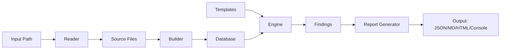
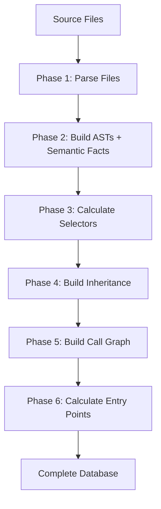
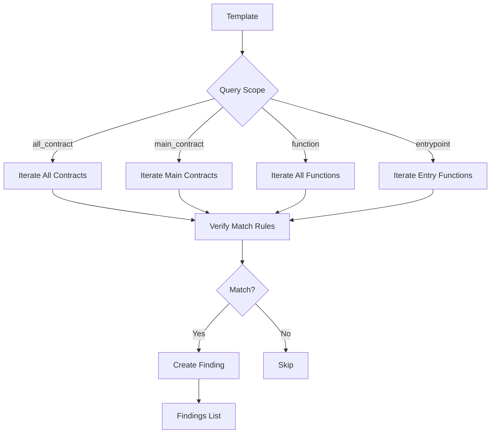
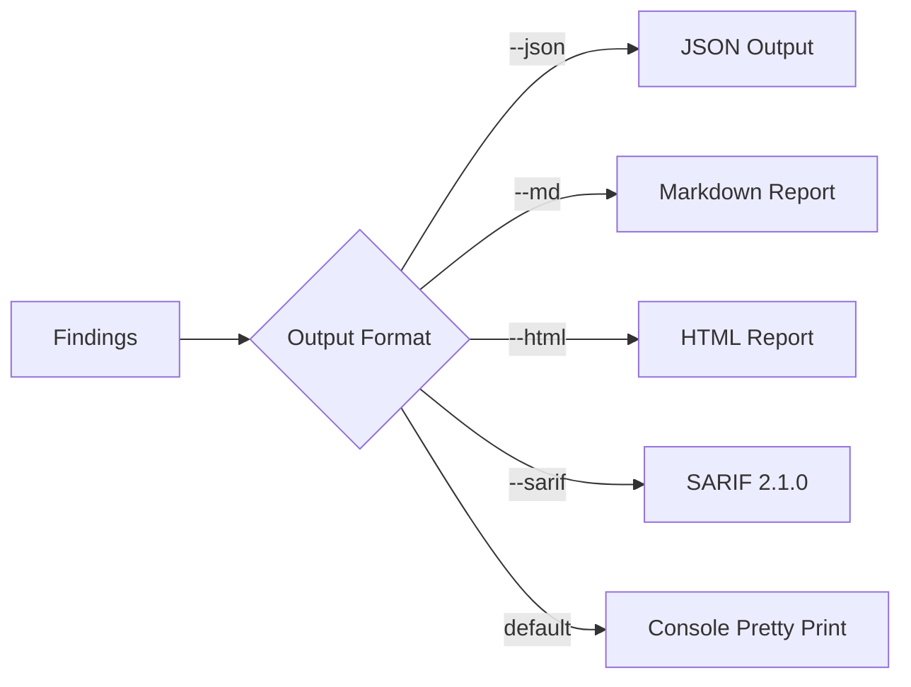
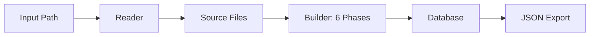
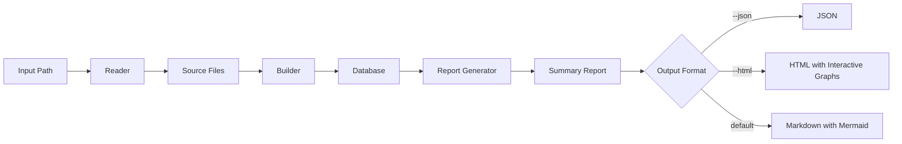
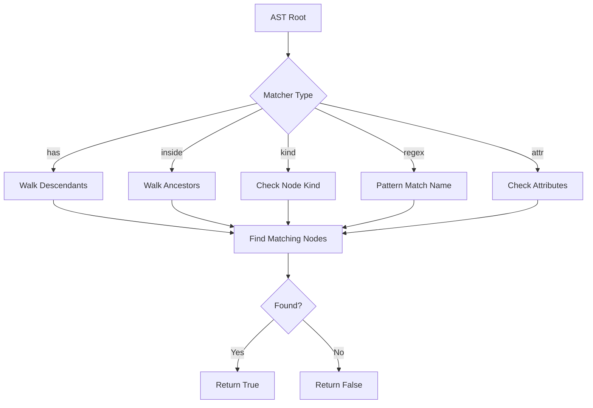
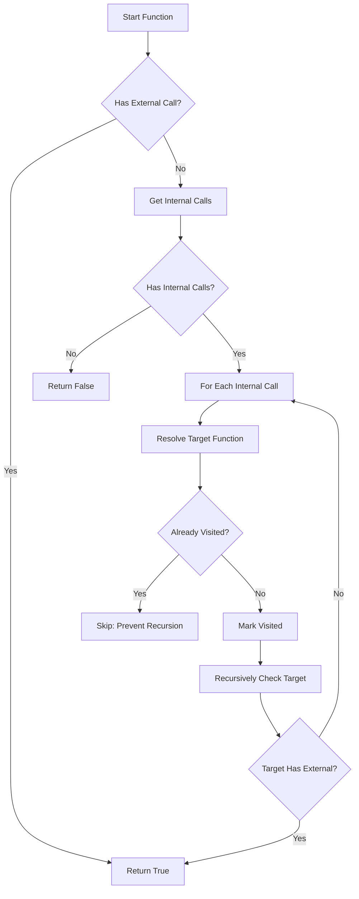

# W3GoAudit Workflows

This document explains the internal workflows of W3GoAudit, detailing how the engine processes Solidity contracts for security analysis.

## Overview

W3GoAudit has three main workflows:

1. **Scan Workflow** - Analyze contracts with security templates
2. **Build Workflow** - Construct contract database
3. **Default Scan Workflow** - Scan + generate project reports (combined)

All workflows share a common foundation: **Reader → Builder → Database**.

---

## 1. Scan Workflow

**Command:** `w3goaudit <path> [--template <template-path>]`

**Purpose:** Scan Solidity contracts for vulnerabilities using WQL templates.
Omitting `--template` uses the embedded official pack (see §3 for the full
flag set, CI gating, and filtering).

### High-Level Flow



### Detailed Steps

#### Phase 1: File Reading
**Component:** [`pkg/reader`](../pkg/reader)

1. **Detect input type** (file or directory)
2. **Recursively discover** `.sol` files
3. **Skip excluded directories**: `node_modules`, `out`, `artifacts`, `test`, `lib`, etc.
4. **Read file contents** into memory
5. **Detect project root** and framework (Foundry/Hardhat/Truffle)

**Code:** [reader.go](../pkg/reader/reader.go)

#### Phase 2: Database Building
**Component:** [`pkg/builder`](../pkg/builder)

The builder constructs a comprehensive database through **6 phases**:

**Phase 1: Parse Files**
- Parse each `.sol` file using [solast-go](https://github.com/th13vn/solast-go)
- Extract contracts, interfaces, libraries
- Extract functions, state variables, structs, events
- Store pragma and import information

**Phase 2: Build ASTs & Semantic Facts**
- Convert raw AST into simplified tree structure
- Build AST for each function body
- Support for all Solidity statement types
- Infer lightweight `TypeInfo` for parameters, state variables, locals, casts,
  builtin address expressions, and member-call receivers
- Store facts in `Database.Semantics` and mirror key facts onto AST attributes
  such as `type_kind` and `receiver_type_kind`

**Phase 3: Calculate Function Selectors**
- Generate function signatures (e.g., `transfer(address,uint256)`)
- Resolve struct types to tuple format
- Calculate 4-byte keccak256 selectors

**Phase 4: Build Inheritance**
- Apply **C3 linearization** for proper method resolution order
- Calculate inheritance weights
- Resolve base contracts

**Phase 5: Build Call Graph**
- Identify internal, external, self, super, and low-level calls
- Resolve call targets using inheritance chain
- Track line numbers for all calls

**Phase 6: Calculate Entry Points**
- Identify main contracts (deployable)
- Find public/external functions
- Resolve inherited functions to their final implementation

**Code:** [builder.go](../pkg/builder/builder.go)



#### Phase 3: Template Loading
**Component:** [`pkg/engine`](../pkg/engine)

1. **Load template file(s)** from YAML
2. **Parse template structure**: meta + query
3. **Validate template syntax**
4. **Fail closed on invalid template directories** — by default, one invalid
   template or zero valid templates aborts the scan; `--ignore-invalid-templates`
   is the explicit ad-hoc escape hatch
5. **Store in engine**

**Code:** [template.go](../pkg/engine/template.go)

#### Phase 4: Query Execution
**Component:** [`pkg/engine`](../pkg/engine)

**Execution flow:**



**Verification process** ([verify.go](../pkg/engine/verify.go)):

1. **Parse match rules** (all/any/not/seq/has/inside)
2. **Check atomic matchers**: kind, regex, attr — when the rule has a
   surface predicate AND the full branch succeeds, the engine records the
   matched AST node as the finding's `PrimaryAST` (the dangerous statement
   to report). Failed branches roll back their provisional capture.
3. **Evaluate context helpers**: mods, inherits, source
4. **Traverse AST** for has/inside operators
5. **Check sequences** for ordered patterns
6. **Perform taint analysis** for source tracking, including caller argument bindings when entrypoints invoke internal helpers — the call chain traversed becomes the finding's `Reachability` (entry → … → host of `PrimaryAST`)

**Advanced features:**
- **Recursive internal call tracing**: Engine follows entrypoint → helper call chains and maps caller argument taint onto callee parameters; the chain itself is preserved on the finding
- **Inheritance-aware matching**: Checks base contracts and modifiers
- **Argument position matching**: Validates specific function arguments
- **Location-source switch**: `--location-source matched`, `WGAUDIT_LOCATION_FROM_MATCHED_NODE=1`, or `Engine.SetLocationSource` flips `Finding.Location` from the verifier-function entrypoint to the host of `PrimaryAST` (SARIF / Slither / Semgrep convention); the new `Reachability` / `EntryPoint` fields are populated regardless

#### Phase 5: Report Generation
**Component:** [`pkg/report`](../pkg/report)

**Findings → Output Format:**



**Output includes:**
- Severity grouping (CRITICAL → HIGH → MEDIUM → LOW → INFO)
- Location information (file, contract, function, line)
- Vulnerability description and recommendation
- Code snippets with context
- Confidence levels
- **Reachability trace** (when populated): full call chain from entry to
  host. Rendered per-format:
  - JSON — `reachability.steps[]`, `entryPoint`, `primaryAst`
  - SARIF — `result.relatedLocations[]` + `result.properties.entryPoint` / `…primaryAst`
  - Markdown — per-occurrence "Reachability path" block with dotted-level indentation (`.`, `..`, `...`) and line numbers per hop
  - HTML — `<div class="w3a-trace">` with depth-scaled `margin-left`
  - Console — `↳ via Entry.func() ⇒ … ⇒ host()` and `↳ fix-here: …` continuation lines

**Code:** [report/](../pkg/report)

---

## 2. Build Workflow

**Command:** `w3goaudit build <path> -o <output.json>`

**Purpose:** Build contract database without running security scans.

### Flow Diagram



### Use Cases

1. **Export database** for external analysis tools
2. **Debug database structure** during development
3. **Cache database** for large projects
4. **Inspect** contracts, functions, and call graphs

### Database Structure

The output JSON contains:

```javascript
{
  "contracts": {
    "path#ContractName": {
      "name": "ContractName",
      "kind": "contract|interface|library",
      "sourceFile": "/absolute/path",
      "functions": [...],
      "stateVars": [...],
      "structs": [...],
      "events": [...],
      "bases": [...],
      "linearizedBases": [...],
      "inheritanceWeight": 0
    }
  },
  "mainContracts": {
    "path#MainContract": ["funcID1", "funcID2", ...]
  },
  "sourceFiles": [...],
  "projectRoot": "/path/to/project"
}
```

**Key fields:**
- `linearizedBases` - C3 linearization order
- `mainContracts` - Deployable contracts with entry function IDs
- `functions[].Calls` - Call graph edges
- `functions[].Selector` - 4-byte function selector

---

## 3. Default Scan Workflow

**Command:** `w3goaudit <path>` (optionally `--template <dir>`, `--md -o <output.md>`, etc.)

**Purpose:** Combined scan that outputs stats, project overview (with call graphs), and security findings.

**Template source:** when `--template` is omitted, the scan uses the **official
pack embedded in the binary** (`templates/embed.go`), so a bare
`w3goaudit <path>` produces findings with no repository checkout. `--template`
overrides with a file or directory.

**CI gating & filtering:**

- `--fail-on <severity>` — exit code **2** when any finding (across *all*
  templates, evaluated *before* the display filters) is at or above the
  threshold, so a display filter cannot silently disarm the gate.
- `--min-severity` / `--include` / `--exclude <id-globs>` — narrow the **reported**
  findings (these do not affect `--fail-on`).
- `--list-templates` — print the rule inventory that would run, then exit.
- `--sarif` — additive SARIF 2.1.0 for GitHub Code Scanning.

Progress/notice/verbose diagnostics go to **stderr**, so a stdout pipe
(`--json`) stays machine-clean.

### Flow Diagram



### Report Contents

**Generated report includes:**

1. **Project Statistics**
   - Total files, contracts, interfaces, libraries
   - Functions count (total and entry functions)
   - Main contracts list

2. **Contract Analysis**
   - Contract hierarchy and inheritance
   - Function visibility breakdown
   - State mutability distribution

3. **Main Contracts Details**
   - Entry points per contract
   - Inheritance tree
   - Function modifiers

4. **Call Graph Visualization**
   - Mermaid diagrams for each main contract
   - Internal call flows
   - External call identification

5. **Security Surface Analysis**
   - Public/external functions
   - Payable functions
   - Functions with external calls

**Code:** [report/summary.go](../pkg/report/summary.go), [report/generator.go](../pkg/report/generator.go)

---

## Internal Workflows

### AST Traversal and Matching

**Used by:** Engine verification



**Supported AST node types:**
- `assignment`, `external_call`, `internal_call`
- `loop`, `if`, `try_catch`, `emit`, `return`
- `identifier`, `literal`, `binary_op`, `member_access`
- `function_call`

### WQL Query Verification

**Process for evaluating a match rule:**

1. **Parse operator** (all/any/not/seq/has/inside/atomic)
2. **For `all`**: All sub-rules must match (AND)
3. **For `any`**: At least one sub-rule must match (OR)
4. **For `not`**: Sub-rule must NOT match
5. **For `seq`**: Sub-rules must match in order on children
6. **For `has`**: Search descendants for match
7. **For `inside`**: Search ancestors for match
8. **For atomic**: Check kind/regex/attr directly

### Recursive External Call Tracing

**Purpose:** Detect external calls through internal function chains

**Algorithm:**



**Code:** [engine.go:tracesExternalCall](../pkg/engine/engine.go#L213-L278)

### Taint Analysis

**Purpose:** Track where identifiers originate from

**Sources tracked:**
- `parameter` - Function parameters (user input)
- `state_var` - Contract state variables
- `local_var` - Local variables

**Use case example:**
Detect when a user-controlled parameter is passed to a dangerous function:

```yaml
args:
  0:
    source: parameter  # First argument comes from user input
```

---

## Performance Considerations

### Reader Optimizations
- Skip common build/test directories
- Stream file reading
- Parallel file discovery (ready for future enhancement)

### Builder Optimizations
- Single-pass parsing with solast-go
- Lazy AST building (only when needed)
- Efficient struct resolution via global map
- Call graph memoization

### Engine Optimizations
- Early exit on non-matching scopes
- Efficient AST traversal with visitor pattern
- Visited set for recursive tracing (prevents infinite loops)

### Report Optimizations
- Template-based HTML generation
- Mermaid diagrams (client-side rendering)
- Streaming JSON output

---

## Error Handling

### Reader
- **Invalid paths**: Clear error messages
- **Non-Solidity files**: Skipped with warning in verbose mode
- **Permission errors**: Reported and skipped

### Builder
- **Parse errors**: File reported, continues with other files
- **Tolerance mode**: Continues on recoverable syntax errors
- **Missing contracts**: Skipped in call graph resolution

### Engine  
- **Invalid templates**: Validation errors with line numbers
- **Unknown operators**: Clear syntax error messages
- **Regex errors**: Pattern compilation errors reported

### Report
- **File write errors**: Permission issues reported
- **Invalid output paths**: Created if parent directory exists

---

## Example Workflow Execution

### Full Scan Example

```bash
w3goaudit ./contracts/ \
  --template ./templates/official/reentrancy-pattern.yaml \
  --md \
  -o report.md \
  --verbose
```

**What happens:**

1. **Reader** discovers all `.sol` files in `./contracts/`
2. **Builder** parses files and builds database (6 phases)
3. **Engine** loads `reentrancy-pattern.yaml` template
4. **Engine** iterates entry functions (scope: entrypoint)
5. **Engine** verifies each function against template rules
6. **Engine** creates findings for matches
7. **Report** formats findings as Markdown
8. **Output** written to `report.md`

**Verbose output shows:**
- Files discovered
- Project root detected
- Framework detected
- Database statistics
- Templates loaded
- Findings count

---

## Related Documentation

- [Usage Guide](./usage.md) - CLI commands and SDK usage
- [WQL Syntax](./wql-syntax.md) - Template writing guide
- [Project Overview](./project-overview.md) - Architecture and design
